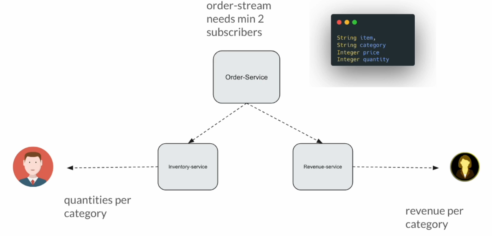
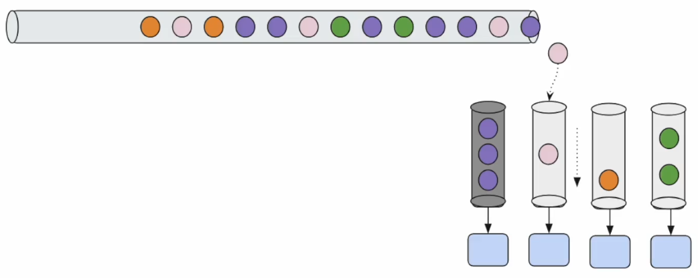

# Reactive Programming Playground

Vemos:

- Mono
- Flux

# Mono

## Creación de proyecto

.

Ver `pom.xml` y la configuración de logs `src/main/resources/logback.xml`.

## Implementación Publisher/Subscriber

En `src/java/com/jmunoz` creamos el package `sec01` y dentro, por temas de organización, los packages `publisher` y `subscriber`.

Dentro del package `subscriber` creamos la clase `SubscriberImpl`.

Dentro del package `publisher` creamos las clases `PublisherImpl` y `SubscriptionImpl`.

En la clase `Demo` tenemos una prueba.

Vamos a crear:

- Publisher
  - Da direcciones de email de clientes.
- Subscription
- Subscriber

Los Reactive Streams ya proveen un conjunto de interfaces y nosotros vamos a crear nuestra propia implementación.

Esto no se tiene que hacer en proyectos reales, ya que usaremos `Project Reactor`, que es una implementación de Reative Streams.

El objetivo es obtener una comprensión básica de como se hace, ver como se conectan, como se hacen peticiones, como trabajan, como se cancela...

### Testing

Ejecutar la clase `Demo`.

## Mono/Flux - Introducción

Comenzamos con `Project Reactor`.

Recordar que `Reactive Stream` es una especificación y `Project Reactor` es una librería que lo implementa (parecido a Hibernate, que es una implementación de la especificación JPA)

Sabemos que `Publisher` es una interfaz del flujo reactivo. La librería `Reactor` provee dos implementaciones diferentes, `Mono` y `Flux`.


**Mono**

- Emite 0 o 1 item.
- Le sigue una señal onComplete / onError

Es decir, si el Publisher puede emitir 1 item, entonces es un caso de éxito, pero si no tiene data que entregar al subscriber obtendremos `onComplete` directamente sin ningún item (recordar que no es obligatorio que el publisher emite un item, puede llamar a onComplete)

Solo en caso de excepción, pasará el `throwable` al subscriber via el método `onError`.

**Flux**

- Emite 0, 1, ... N items.
- Le sigue una señal onComplete / onError

Flux puede ser un flujo infinito que nunca acabe, por ejemplo el precio de Bitcoin puede cambiar cada segundo, así que no se para de emitir su nuevo precio.

El publisher obtiene la data de fuentes como bases de datos, y se la pasa al subscriber cuando este se la pide.

El flujo (stream) puede completarse via método `onComplete` una vez que se haya emitido toda la data, o el subscriber puede cancelar cuando ya no necesite más data.

El publisher puede llamar al método `onError` si encuentra alguna excepción, cancelando la emisión de data.

## ¿Por qué necesitamos Mono?

Si tenemos `Flux`, ¿por qué necesitamos `Mono`?

La respuesta más sencilla es que `Mono` es muy conveniente cuando sabemos seguro que vamos a obtener solo 1 item del publisher.

Ejemplo usando `JpaRepository`:

```java
interface CustomerRepository extends JpaRepository<Customer, Long> {
    List<Customer> findByFirstname(String firstname);
    Optional<Customer> findById(Long id);
}
```

En esta petición `Optional<Customer> findById(long id);` sabemos que, si encuentra el id, obtendremos un registro y, si no lo encuentra, 0 registros. Usaremos `Mono`.

Sin embargo, en esta petición `List<Customer> findByFirstname(String firstname);` sabemos que vamos a obtener entre 0 y N registros, por lo que usaremos `Flux`.

El mismo ejemplo usando `ReactiveCrudRepository` queda, por tanto:

```java
interface CustomerRepository extends ReactiveCrudRepository<Customer, Long> {
    Flux<Customer> findByFirstname(String firstname);
    Mono<Customer> findById(Long id);
}
```

Tanto `Mono` como `Flux` pueden manejar data de una forma no bloqueante, asíncrona. Las diferencias son:

- Flux
  - Flujo de mensajes.
  - Backpressure (Producer emite mucha data que el consumer no puede manejar)
  - Muchos métodos adicionales específicos para manejar el procesamiento del flujo.
- Mono
  - Sin flujos (no stream!)
  - Sin Backpressure.
  - Un publisher ligero.
  - Modelo de comunicación Request -> Response

## Stream Lazy Behaviour

En `src/java/com/jmunoz` creamos el package `sec02` y dentro creamos la clase:

- `Lec01LazyStream`
  - El objetivo de esta clase es entender que un flujo (stream) por defecto es lazy.
  - Hasta que el flujo no se conecta a una salida no se ejecuta ni se obtiene el resultado.
  - La programación reactiva es igual.
  - Hasta que no nos conectemos a un subscriber no se ejecuta nada ni obtendremos ningún resultado.

## Mono Just

Cómo crear un publisher Mono usando métodos Factory para soportar la base de código existente en el proyecto.


**¿Por qué se creó este método just()?**

En la programación reactiva, cualquier cosa puede ser un publisher o un subscriber.

Por ejemplo, si hacemos una petición a la BD, la BD es el publisher y nosotros somos el subscriber.

Si vamos a guardar un registro en BD, entonces nosotros somos el publisher y la BD será el subscriber.

Imaginemos este código:

```java
private static void save(Publisher<String> publisher) {
    
}
```

A veces necesitamos crear rápidamente un publisher para poder consumir ese método. De ahí la necesidad de que exista `just()`.

```java
save(Mono.just("José"));
```

Por tanto, si tenemos un valor en memoria y por cualquier razón necesitamos crear un publisher usando ese valor, sencillamente usaremos el método `just()` para convertirlo en un publisher.

En `src/java/com/jmunoz/sec02` creamos la clase:

- `Lec02MonoJust`
  - Nuestra primera clase 100% reactiva.
  - Just es un Factory Method.

## Mono Subscribe - Overloaded Methods

Como se ha comentado, el método `subscribe()` está bastante sobrecargado. En esta clase vamos a explorarlos.

En `src/java/com/jmunoz/sec02` creamos la clase:

- `Lec03MonoSubscribe`

## Creating Default Subscriber

Para incrementar nuestra productividad y no tener que estar creando subscriber (el consumer del ejemplo anterior) cada dos por tres, vamos a crear un subscriber genérico que utilizaremos en los ejemplos.

En `src/java/com/jmunoz` creamos el paquete `common` y dentro las clases:

- `DefaultSubscriberImpl`
  - Creación de un Subscriber genérico.
- `Util`
  - Contiene la creación de nuestro Subscriber por defecto y una demo del funcionamiento.

## Mono - Empty / Error

Vemos como crear un publisher que no va a dar data y que pasa un mensaje de error.

En `src/java/com/jmunoz/sec02` creamos la clase:

- `Lec04MonoEmptyError`

## On Error Dropped - Problem

Volver a ver la clase `Lec04MonoEmptyError`.

## Mono - From Supplier

En la programación reactiva, tenemos que ser lo más perezoso (lazy) posibles.

A veces, deberemos retrasar la ejecución y hacer el trabajo solo cuando se requiere. En caso contrario, si no se requiere, no se hace nada.

En `src/java/com/jmunoz/sec02` creamos la clase:

- `Lec05MonoFromSupplier`

## Mono - From Callable

Project Reactor soporta el tipo Supplier, pero también el tipo Callable, que también demora la ejecución (lazy).

Tanto Supplier como Callable son interfaces funcionales en Java, pero son dos interfaces diferentes.

Supplier no lanza excepciones, no tiene la excepción como parte de su firma de método. Puede lanzar Runtime Exception pero no Checked Exception.

Callable puede lanzar excepciones como parte de su firma de método

En `src/java/com/jmunoz/sec02` creamos la clase:

- `Lec06MonoFromCallable`

## Mono - From Runnable

El caso de uso es el siguiente. Si necesitamos invocar un método y después enviar empty, entonces usaremos fromRunnable.

Igual que tenemos la diferencia entre Mono.just y Mono.fromSupplier, tenemos Mono.empty y Mono.fromRunnable.

En `src/java/com/jmunoz/sec02` creamos la clase:

- `Lec07MonoFromRunnable`

## Mono - From Future

Vamos a ver como convertir un CompletableFuture en un publisher Mono.

En `src/java/com/jmunoz/sec02` creamos la clase:

- `Lec08MonoFromFuture`

## Publisher - Create vs Execute

Esta es una clase para clarificar conceptos, en concreto, que no es lo mismo crear un publisher que ejecutarlo.

En `src/java/com/jmunoz/sec02` creamos la clase:

- `Lec09PublisherCreateVsExecution`

## Mono - Defer

Usaremos defer() para retrasar la creación de un publisher.

Aunque normalmente la creación de un objeto publisher es un proceso muy ligero, si en nuestro caso debe retrasarse incluso la creación del mismo, puede hacerse usando defer().

En `src/java/com/jmunoz/sec02` creamos la clase:

- `Lec10MonoDefer`

## Data from Remote Service

Hasta ahora hemos discutido sobre varios métodos Factory que Mono provee para crear rápidamente un tipo Publisher.

Estas opciones serán muy útiles cuando queramos usar una librería, algún framework con métodos como estos, que aceptan un tipo Publisher:


En este ejemplo, nosotros seríamos los Publisher y el framework sería el subscriber.

Pero, ¿qué pasa si necesitamos data de un servicio remoto o una base de datos? Un ejemplo parecido al de la imagen de arriba no va a ser posible. Para operaciones de entrada/salida no podemos usarlo.

Para poder usar esto, necesitamos drivers adecuados o clientes adecuados para enviar la request.

Por ejemplo, si hablamos de HTTP, usaremos Spring WebFlux, que nos permitirá desarrollar microservicios reactivos más robustos.

O si hablamos de BD relacionales, usaremos R2DBC.

El caso es que para poder usar Spring WebFlux o R2DBC, tenemos que saber trabajar muy bien con la programación reactiva.

Para hacer los ejemplos más interesantes, haremos peticiones reales HTTP en vez de usar Faker o métodos privados estáticos.

Y, para ello, usaremos la dependencia Project Reactor Netty, que es capaz de mandar peticiones HTTP no bloqueantes.

## External Services

Usaremos un fichero jar para demostrar HTTP no bloqueante.

**How To Run**

- Ensure that you have Java 17 or anything above installed
- Use the jar `external-services.jar`
- Open terminal/command line and navigate to the path where you have the jar
- Run this command: `java -jar external-services.jar`
- It uses port 7070 by default: `http://localhost:7070`

En esta sección vamos a probar el endpoint `demo01`, donde tenemos que imaginar que es un microservicio Product Service, donde pasamos un productId y nos devolverá el nombre del producto.

Está hecho adrede para que la respuesta tarde un segundo en devolverse, más o menos parecido a como si fuera una respuesta HTTP real.

La idea es centrarnos en cómo enviar peticiones HTTP a la manera reactiva, no bloqueante.

Ya en el siguiente punto, vamos a usar Reactor Netty para enviar peticiones HTTP para un productId y vamos a obtener la respuesta.

## Non-Bloking IO Client

Ahora si, vamos a usar Project Reactor Netty para enviar peticiones HTTP al Product Service para obtener la información del producto.

No olvidar arrancar el proyecto `external-services.jar`.

Añadimos a nuestro pom la dependencia:

```xml
<dependency>
    <groupId>io.projectreactor.netty</groupId>
    <artifactId>reactor-netty-core</artifactId>
</dependency>
<dependency>
    <groupId>io.projectreactor.netty</groupId>
    <artifactId>reactor-netty-http</artifactId>
</dependency>
```

Estas dependencias son las mismas que usa Spring WebFlux por debajo, pero WebFlux simplifica mucho la serialización, deserialización..., mientras que Reactor Netty es de bajo nivel, lo que puede ser un poco confuso al principio.

Pero dejar claro que, en la vida real, usaremos Spring WebFlux, aunque en este curso nos centramos en aprender el core de la programación reactiva.

Creamos una clase abstracta usando Netty para enviar peticiones HTTP. Con esto facilitamos el curso, ya que va a haber muchas demos y podemos extender esa clase abstracta rápidamente para enviar una petición o recibir una respuesta.

En el package `common` crearemos la clase `AbstractHttpClient`.

En `src/java/com/jmunoz/sec02` creamos el package `client`, el cliente para HTTP, y dentro la clase:

- `ExternalServiceClient` que extiende `AbstractHttpClient`.

## Non-Bloking IO Demo

Este punto es continuación del anterior. Usando el cliente ya construido, vamos a enviar una petición HTTP, en concreto, pasaremos un productId y obtendremos el nombre del producto.

No olvidar arrancar el proyecto `external-services.jar`.

En `src/java/com/jmunoz/sec02` creamos la clase:

- `Lec11NonBlockingIO`

## Como funciona Event Loop

Vamos a ver como funciona IO no bloqueante (o event loop).

Como parte del event loop, tendremos 1 thread y una cola de salida. Cuando hacemos las peticiones a Reactor Netty, se añaden las tareas a una cola.

El event loop thread continuamente mira las tareas en esta cola. Si hay tareas que realizar, las haces, si no, espera ocioso.

Cuando hay tareas en la cola, coge la primera tarea y la envia al servicio remoto. Sabemos que el servicio remoto tarda 1sg en ejecutarse.

Pero el event loop no está ocioso esperando la respuesta (no espera 1sg), sino que cogerá la siguiente tarea y enviará la petición de nuevo al servicio remoto.

Así hasta completar la cantidad de tareas que tenga en la cola.

¿Qué respuesta nos llega antes? No lo sabemos, la que la red (no la programación reactiva ni Java, sino la red), por los motivos que sea, nos entregue primero. Es decir, no hay orden en las respuestas.

El Sistema Operativo notificará al thread que nos ha llegado una respuesta y esta respuesta va a una cola de entrada. Seguirán llegando respuestas que irán a esta cola de entrada y de ahí a nosotros.

Un solo thread es suficiente para enviar cientos de peticiones concurrentes.


## ¿Por qué no deberíamos usar Block?

Vamos a ver en esta clase por qué no deberíamos usar el método `block()` en programación reactiva.

En este ejemplo que se puede añadir a `Lec11NonBlockingIO` vemos:

```java
for (int i = 1; i <= 5; i++) {
    var name = client.getProductName(i)
            .block();
}
```

`block()` nos devuelve el valor, es decir, en vez de obtener un Mono<String> nos devuelve directamente el String.

Para eso, lo que hace por detrás es subscribirse automáticamente al publisher.

Pero el problema es que bloquea el thread porque no continua hasta que no obtiene el valor. Es decir, las peticiones se vuelven secuenciales.

¿Cuándo podemos usar block()? En tests unitarios, porque ese código no va a producción.

También, algunos dicen que usando Virtual Threads es correcto usar block. Esto no es totalmente correcto, solo cuando no tratamos con Flux, ya que entonces perderíamos los beneficios de la programación reactiva.

## Ejercicio

En `src/java/com/jmunoz/sec02/assignment` creamos la interface `FileService` que cree el contrato:

- Leer fichero y devolver contenido.
- Crear fichero y escribir contenido.
- Borrar fichero.

Y su implementación `FileServiceImpl`.

También creamos la clase de prueba `Assignment`.

Suposiciones:

- Los ficheros son de tamaño muy pequeño (no obtendremos errores del tipo OutOfMemory).
- Los ficheros deben estar en `src/main/resources/sec02`.

Expectativas:

- Los métodos de FileService deberán hacer el trabajo solo cuando los subscribers se subscriban.
- Comunicar el error al subscriber en caso de problemas.
- No hay necesidad de ninguna librería especial.

## Resumen Mono

- La programación reactiva es un paradigma de programación para manejar operaciones IO más eficientemente.
- Reactive Streams es una especificación.
  - Reactor es una implementación.
- Mono & Flux
  - Mono - emite 0/1 item
    - Request -> Response
  - Flux - emite 0 ... infinito

# Flux

- Flux puede emitir 0, 1 ... N items.
- Seguido de onComplete / onError.

Puede ser un flujo de mensajes interminable, y, en este caso, nunca obtendremos un onComplete/onError.

Flux, al igual que Mono, provee factory methods para poder crearlo rápidamente a partir de data existente, como, por ejemplo:

- just
  - Muy útil cuando tenemos data en memoria.
- fromIterable
  - Si tenemos una lista o array, o un Java stream.
- fromArray
- fromStream


Esta no es una lista exhaustiva, ya que hay más métodos avanzados para crear un Flux, y los veremos más adelante, pero estos son los más comunes.

## Flux - Just

Usaremos el factory method `Flux.just()` cuando tengamos data en memoria.

En `src/java/com/jmunoz/sec03` creamos la clase:

- `Lec01FluxJust`

## Flux - Multiple Subscribers

En `src/java/com/jmunoz/sec03` creamos la clase:

- `Lec02MultipleSubscribers`
  - Vemos que un publisher puede tener varios subscribers y aplicamos filtros y map.

## Flux - From Array / List

En `src/java/com/jmunoz/sec03` creamos la clase:

- `Lec03FluxFromIterableOrArray`
  - Vamos a ver como crear un publisher Flux a partir de un array o un iterable.

## Flux - From Stream

Esta clase es muy importante, ya que hay algo complicado que es la conversión de un Java Stream a un Flux.

Esto es que cuando el stream ya se ha consumido, no se puede volver a usar.

Para evitar el problema y poder tener más de un subscriber, debemos proveer el supplier, que nos va a dar el stream cada vez que se necesite.

En `src/java/com/jmunoz/sec03` creamos la clase:

- `Lec04FluxFromStream`
  - Vamos a ver como crear un publisher Flux a partir de un Java Stream.

## Flux - Range

En `src/java/com/jmunoz/sec03` creamos la clase:

- `Lec05FluxRange`
  - Vamos a crear un publisher Flux a partir de un rango de números.
  - Podemos usarlo como un bucle for en programación reactiva.

## Log Operator

En `src/java/com/jmunoz/sec03` creamos la clase:

- `Lec06Log`
  - El operador log nos permite ver lo que está pasando en el publisher, es decir, ver los items que se están emitiendo.
  - Es muy útil para debugging.

## Flux vs List

Vamos a implementar un requerimiento de negocio, generar nombres, de dos formas distintas, una usando Flux y otra usando List.

Este es el comportamiento:


- List: Genera todos los nombres y los devuelve en una lista. Si cada nombre tarda 1 segundo en generarse, tardará 10 segundos en devolver la lista completa.
- Flux: Genera los nombres uno a uno, de forma que cada nombre se devuelve en 1 segundo, pero el siguiente nombre se genera mientras el subscriber está procesando el anterior. Por tanto, al cabo de 10 segundos, ya tenemos todos los nombres generados.
  - El subscriber puede procesar los nombres a su ritmo, sin necesidad de esperar a que se generen todos y puede cancelar la emisión en cualquier momento.

En `src/java/com/jmunoz/sec03` creamos la clase:

- `Lec07FluxVsList`

Y en `src/java/com/jmunoz/sec03/helper` creamos la clase:

- `NameGenerator`
  - Genera nombres aleatorios.

## ¿Son Mono & Flux estructuras de datos?

- List<T>, Set<T>...
  - Son una representación de data en la memoria.
  - Almacenan data (finita).
- Flux<T>, Mono<T>
  - Representan un tunel/pipe a través del cual la data puede transferirse de un lugar a otro.
  - No almacenan data, la transmiten, por lo que puede ser infinita.

Es decir, Mono y Flux no son estructuras de datos, sino que son una representación de un flujo de data.


Donde App1 es el publisher y App2 es el subscriber.

## Flux - Non-Blocking IO Stream - Demo

Vamos a ver como podemos consumir el flujo de mensajes usando HTTP Reactor Netty.

- Arrancar el proyecto `java -jar external-services.jar` e ir al navegador a `http://localhost:7070/webjars/swagger-ui/index.html`.
  - Usaremos el endpoint `demo02/name/stream` que genera nombres aleatorios cada 500ms.
    - Pulsamos Execute y esperamos. Veremos que tarda pero devuelve un 200 y una lista de nombres.
    - Veremos la siguiente Request URL: `http://localhost:7070/demo02/name/stream` y la copiamos y pegamos en el navegador.
    - Veremos que van saliendo los nombres (flujo de mensajes) uno a uno, cada 500ms.

¿Cómo puedo desarrollar una aplicación exponiendo una API con un flujo de mensajes? Esto lo veremos en el curso Spring WebFlux. Ahí se ve como desarrollar microservicios reactivos.

Ahora vamos a ver como consumir este flujo de mensajes usando Reactor Netty.

En `src/java/com/jmunoz/sec03` creamos la clase:

- `Lec08NonBlockingIOStreamingMessages`

En `src/java/com/jmunoz/sec03/client` creamos la clase:

- `ExternalServiceClient`
  - Enviamos una petición HTTP.

## Flux - Interval

La idea de Interval es que, en vez de tener una data y emitirla, lo que tenemos es un requerimiento de emitir data cada cierto tiempo, de forma no bloqueante.

En `src/java/com/jmunoz/sec03` creamos la clase:

- `Lec09FluxInterval`

## Flux - Empty / Error

Flux no tiene por qué estar emitiendo data todo el tiempo. Si no tiene nada que emitir, puede enviar empty o la señal onComplete directamente.

En `src/java/com/jmunoz/sec03` creamos la clase:

- `Lec10FluxEmptyError`
  - Vamos a ver como crear un publisher que no va a dar data y que pasa un mensaje de error.

## Flux - Defer

Hasta ahora no hemos visto como retrasar la ejecución de un publisher Flux.

Usaremos el método `defer()` que acepta un Supplier que nos va a dar el publisher cada vez que se necesite.

Ejemplo:

```java
Flux.defer(() -> Flux.fromIterable(createList()));
```

Con esto terminamos de ver como crear un Flux cuando tenemos la data en memoria.

En otras secciones de este curso veremos como crear un Flux de formas más avanzadas. 

## Mono/Flux Conversion

En `src/java/com/jmunoz/sec03` creamos la clase:

- `Lec11FluxMono`
  - Vamos a ver como convertir un Mono en un Flux y viceversa.
  - Usaremos el método Flux.from() donde le pasamos un Mono y nos devuelve un Flux.
  - Usaremos el método Mono.from() donde le pasamos un Flux y nos devuelve un Mono, o el método next() para obtener el primer item del Flux.

## Ejercicio

- Arrancar el proyecto `java -jar external-services.jar` e ir al navegador a `http://localhost:7070/webjars/swagger-ui/index.html`.
  - Usaremos el endpoint `demo02/stock/stream` que genera cambios de precios.
    - Pulsamos Execute y esperamos 20sg hasta que termine. Veremos que devuelve un 200 y una lista de números.
    - Veremos la siguiente Request URL: `http://localhost:7070/demo02/stock/stream` y la copiamos y pegamos en el navegador.
    - Veremos que van saliendo precios (flujo de mensajes) uno a uno, cada 500ms.

La tarea es la siguiente:

- Crear un subscriber con un balance inicial de $1000.
- Cuando el precio cae por debajo de 90, comprar una acción.
- Cuando el precio sube por encima de 110:
  - Vender todo.
  - Cancelar la suscripción.
  - Imprimir la ganancia obtenida.

En `src/java/com/jmunoz/sec03/assignment` creamos la clase:

- `Assignment`

En `src/java/com/jmunoz/sec03/client` creamos un método en la clase:

- `ExternalServiceClient`

## Resumen Flux

- Flux emite 0, 1, ..., N items.
- Seguido de onComplete / onError.
- Hemos visto Factory Methods para crear un Flux, pero no ha sido una lista exhaustiva.

# Flux - Emitir items programáticamente

En la sección anterior hemos visto como crear un Flux a partir de data existente, pero no hemos visto como emitir items programáticamente, por ejemplo emitir data hasta que se cumpla una condición.

## Flux Create

Para esto, Reactor provee algunas opciones que son las que vamos a ver en esta sección.

En `src/java/com/jmunoz/sec04` creamos la clase:

- `Lec01FluxCreate`
  - Vemos el método `Fkux.create()`

## Flux Create - Refactor

En la clase anterior vimos como añadir toda la lógica dentro de la expresión lambda del método `Flux.create()`.

Pero si hay mucha lógica, es mejor refactorizarla a un método/clase aparte.

En `src/java/com/jmunoz/sec04` creamos el package `helper` y dentro la clase:

- `NameGenerator`
  - Implementamos un consumer.

En `src/java/com/jmunoz/sec04` creamos la clase:

- `Lec02FluxCreateRefactor`
  - Vemos como refactorizar `Lec01FluxCreate` para que sea más limpio.

## Flux Sink - Thread Safety

Flux Sink es thread safe, es decir, podemos emitir items desde diferentes threads sin problemas.

En `src/java/com/jmunoz/sec04` creamos la clase:

- `Lec03FluxSinkThreadSafety`
  - Vemos como usar Flux Sink para emitir items desde diferentes threads.

## Flux Create - Comportamiento por defecto

Vamos a ver el comportamiento por defecto de `Flux.create()`, que puede no gustarnos, ya que no es lo que esperamos.

El producer produce los items por adelantado, sin esperar a que el subscriber haga un request.

En `src/java/com/jmunoz/sec04` creamos la clase:

- `Lec04FluxCreateDownstreamDemand`

## Flux Create - Emit on Demand

Vamos a cambiar el comportamiento por defecto de `Flux.create()` para que emita los items bajo demanda, es decir, cuando el subscriber haga un request.

En `src/java/com/jmunoz/sec04` creamos la clase:

- `Lec04bFluxCreateDownstreamDemand`

## Flux Sink - Casos de uso

Flux.create -> FluxSink:

- Diseñado para usarse cuando tenemos un solo subscriber.
- FluxSink es thread safe. Podemos compartirlo entre varios threads.
- Podemos mantener la emisión de items al sink sin tener que preocuparnos de una baja demanda.
- FluxSink entregará todo al subscriber de forma segura, secuencialmente, de uno en uno.
  - No hay problemas de race condition ya que se sincroniza internamente.

## Take Operators

Vamos a hablar del operador `take()`, que nos permite limitar el número de items que se emiten. Es muy parecido a `limit()` en Java Streams.

También hablaremos del operador `takeWhile()` que nos permite emitir items mientras se cumpla una condición.

También hablaremos del operador `takeUntil()`, que nos permite emitir items hasta que se cumpla una condición.

En `src/java/com/jmunoz/sec04` creamos la clase:

- `Lec05TakeOperator`
  - Vemos como usar el operador `take()` para limitar el número de items que se emiten.
  - Vemos como usar el operador `takeWhile()` para emitir items mientras se cumpla una condición.
  - Vemos como usar el operador `takeUntil()` para emitir items hasta que se cumpla una condición.

## Flux Generate

Mientras que `Flux.create()` acepta un Consumer de `FluxSync`, el método `Flux.generate()` acepta un Consumen de `SynchronousSink`.

La diferencia es que con `Flux.generate()` podemos emitir solo un item y que con `Flux.create()` obteníamos la request y nos permitía controlar el bucle para emitir items. Es decir es de más bajo nivel.

Con `Flux.generate()` tenemos que pensar que internamente existe ese bucle que obtiene el request de forma automática. Es de más alto nivel.

¿Cuál es la diferencia con un `Mono`? Un `Mono` permite emitir solo un item y se acabó, pero con `Flux.generate()` podemos usar un `SynchronousSink` para emitir un valor una y otra vez, mientras no se ejecute `complete()` o `error()`.

En `src/java/com/jmunoz/sec04` creamos la clase:

- `Lec06FluxGenerate`
  - Vemos en este ejemplo que `Flux.generate()` solo permite emitir un item, pero las veces que queramos, bajo demanda.

## Flux Generate - Emit Until

En `src/java/com/jmunoz/sec04` creamos la clase:

- `Lec07FluxGenerateUntil`
  - Vemos como usar `Flux.generate()` para emitir items hasta que se cumpla una condición.

## Flux Generate - State problem

Vamos a hablar de un posible problema que puede surgir al usar `Flux.generate()` cuando tenemos un estado mutable.

`Flux.generate()` es sin estado.

En `src/java/com/jmunoz/sec04` creamos la clase:

- `Lec08GenerateWithState`
  - Vemos los problemas que pueden surgir al usar `Flux.generate()` con un estado mutable.

## Flux Generate - State Supplier

Para evitar el problema del estado mutable, podemos proveer el estado como un valor inicial (un objeto, una conexión a BD, lo que queramos) que se invoca una sola vez, al método `Flux.generate()`.

Ese objeto se pasa también junto con `synchronousSink` y se puede usar para emitir items.

Se devuelve el estado actualizado al final de la ejecución.

Si el estado inicial consiste en abrir una conexión a BD, ¿cuándo se cierra? Se acepta un tercer parámetro para ello (optativo).

```java
Flux.generate(
        () -> someObject,  // Invocado solo una vez
        (someObject, synchronousSink) -> {
            // Aquí podemos usar someObject para emitir items
            // ...
            return someObject;  // Devolvemos el estado actualizado
        },
        someObject -> close   // Invocado solo una vez. Sirve también para onComlete, onError, onCancel...
)
```

- `Lec08bGenerateWithState`
  - Vemos la solución al problema del estado mutable usando un estado inicial.

## Ejercicio

Vamos a implementar la siguiente interface:

```java
public interface FileReaderService {
    Flux<String> read(Path path);
}
```

En `src/java/com/jmunoz/sec04/assignment` creamos la interface `FileReaderService` que cree el contrato:

- Leer fichero y devolver contenido.
- Crear fichero y escribir contenido.
- Borrar fichero.

Y su implementación `FileReaderServiceImpl`.

También creamos la clase de prueba `Assignment`.

## Resumen


En `Flux.generate()`, como solo se emite un item, no tiene sentido compartirlo con varios threads, así que no aplica.

**Flux.create()**

- Diseñado para usarse cuando tenemos un solo subscriber.
- FluxSink es thread safe. Podemos compartirlo entre varios threads.
- Podemos mantener la emisión de items al sink sin tener que preocuparnos de una baja demanda.
- FluxSink entregará todo al subscriber de forma segura, secuencialmente, de uno en uno.
- Items pendientes
  - ¿Qué pasa si quiero tener varios subscribers?
  - Gestión de backpressure, ya que en algún momento la cola se va a llenar.

**Flux.generate()**

- Permite crear una utilidad genérica.

# Operators

## Introducción


Este ejemplo quiere decir:

- Tenemos un expresso.
- Si le añadimos agua, tenemos un americano.
- Pero si le añadimos leche al vapor, tenemos un flat white.
- ...

Los operadores son como decoradores o ingredientes que añadimos para decorar nuestro publisher con comportamientos adicionales, basado en los requerimientos de negocio.

Siempre que se añade un comportamiento adicional via operator, se devuelve una nueva instancia, un nuevo objeto Java publisher. Este nuevo objeto es al que nos tenemos que subscribir.

Se llama pipeline a la cadena de operadores que se aplican a un publisher. La data fluye a través de este pipeline y finalmente llega al subscriber.

Estos operators ya los hemos visto antes:

- filter
- map
- log
- take
- takeWhile
- takeUntil

## Operator - Handle

En `src/java/com/jmunoz/sec05` creamos la clase:

- `Lec01Handle`
  - Handle se comporta como un filter + map.

## Operator - HandleUntil

En `src/java/com/jmunoz/sec05` creamos la clase:

- `Lec02HandleUntil`
  - Ejemplo de uso de handle para filtrar hasta que se encuentre un elemento específico.

## Do Hooks/Callbacks

Hay una gran cantidad de operators do que se pueden usar, los más comunes son:

- doOnNext
- doOnSubscribe
- doOnComplete
- doOnError
- doOnCancel
- doFinally
- doOnRequest
- doFirst

En `src/java/com/jmunoz/sec05` creamos la clase:

- `Lec03DoCallbacks`
  - Vemos ejemplos de como usar los callbacks doOnNext, doOnSubscribe, doOnComplete, doOnError, doOnCancel, doFinally, doOnRequest...

## Operator - doOnNext - Clarificación

En programación reactiva, el operador `doOnNext()` es algo que podemos usar dependiendo de nuestro caso de uso.

Esto es porque muta la data, y en principio, no es lo mejor, pero todo depende del contexto. En concreto:

- La inmutabilidad es buena, pero esto no significa que la mutación sea mala.
- La programación funcional prefiere funciones puras (sin efectos secundarios).
  - ¡Preferir funciones puras!

Pero tener en cuenta que los objetos Entity son objetos mutables. Los arquitectos Java dicen que la mutación tiene sus ventajas si se sabe como usarla.

```java
interface CustomerRepository extends ReactiveCrudRepository<Customer, Long> {
    Flux<Customer> findByFirstname(String firstname);
    Mono<Customer> findById(Long id);
}

// Con programación clásica
// Si la interface devuelve un Mono, esto no tiene mucho sentido porque Mono no es bloqueante, no sabemos cuando vamos a obtener Customer.
var customer = this.repository.findById(123).get();
customer.setAge(10);
this.repository.save(customer);

// Con programación reactiva
this.repository.findById(123)
    .doOnNext(customer -> customer.setAge(10))
    .flatMap(this.repository::save);
```

Indicar que `findById()` devuelve un `Mono<Customer>`, no un Optional. Este Mono es un publisher, y ya sabemos que es no bloqueante.

Esto significa que no sabemos cuando vamos a obtener el objeto Customer. En este caso el método `doOnNext()` es muy útil. Cuando obtenemos el valor, lo mutamos y luego lo guardamos.

Project Reactor garantiza que internamente se sincroniza y la mutación es segura, hecha por un thread y no vendrá otro thread a mutar el mismo objeto al mismo tiempo.

## Operator - Delay Elements

En `src/java/com/jmunoz/sec05` creamos la clase:

- `Lec04Delay`
  - Vemos como retrasar la emisión de items usando el operador `delayElements()`.

## Subscribe

En `src/java/com/jmunoz/sec05` creamos la clase:

- `Lec05Subscribe`
  - Vemos los operadores doOnNext(), doOnComplete() y doOnError(), que se pueden usar en vez de indicar el subscriber en .subscribe().

## Error Handling

Esta es una clase muy importante.

Vemos como manejar los errores en un pipeline reactivo, tanto Flux como Mono.

En programación tradicional, tenemos el bloque try-catch para manejar excepciones. ¿Qué pasa en programación reactiva?

En `src/java/com/jmunoz/sec05` creamos la clase:

- `Lec06ErrorHandling`
  - Vemos las formas de manejar errores en un flujo reactivo, valiendo igual para Mono que para Flux.
  - `onErrorReturn`.
  - `onErrorResume`.
  - `onErrorComplete`.
  - `onErrorContinue`.

## Operator - Default If Empty

En `src/java/com/jmunoz/sec05` creamos la clase:

- `Lec07DefaultIfEmpty`
  - Vemos como usar el operador `defaultIfEmpty()` para devolver un valor por defecto si el publisher no emite ningún item.

## Operator - Switch If Empty

En `src/java/com/jmunoz/sec05` creamos la clase:

- `Lec08SwitchIfEmpty`
  - Vemos como usar el operador `switchIfEmpty()` para cambiar a otro publisher si el publisher original no emite ningún item.

## Operator - Timeout

Vamos a hablar del operator `timeout`.

En casos en que hacemos peticiones a servicios remotos, es importante saber que si no obtenemos una respuesta en un tiempo determinado, debemos manejar el timeout.

Por ejemplo, esperamos 1sg para obtener la respuesta de un servicio remoto, pero si no obtenemos la respuesta en ese tiempo, vamos a asumir un valor por defecto.

En `src/java/com/jmunoz/sec05` creamos la clase:

- `Lec09Timeout`
  - Vemos como usar el operador `timeout()` para manejar el timeout en un flujo reactivo.

## Operator - Transform

Este método nos ayuda a escribir código reutilizable en el pipeline reactivo.

Igual que en POO consideramos todo un objeto, en programación reactiva todo el flujo de trabajo empresarial que construyamos será un publisher y un subscriber, donde la data fluirá de uno a otro.

Podemos tener muchos requerimientos de flujos de trabajo empresariales, y muchas veces veremos que hay pasos redundantes en otros pipelines.

Necesitamos una forma de poder reutilizar esos pasos entre todos los pipelines reactivos que construyamos. Usaremos el operador `transform()` para ello.

El método `transform()` nos ayuda a construir estos pasos de forma separada.


Es muy parecido a decir que construimos un operator personalizado.

En `src/java/com/jmunoz/sec05` creamos la clase:

- `Lec10Transform`
  - Vemos como usar el operador `transform()` para construir pasos reutilizables en un pipeline reactivo.

## Ejercicio

- Para este ejercicio, arrancar el proyecto `java -jar external-services.jar` e ir al navegador a `http://localhost:7070/webjars/swagger-ui/index.html`.
- Usaremos los tres endpoints que existen en `demo03/`.

En `src/java/com/jmunoz/sec05/assignment` creamos la clase:

- `Assignment`

En `src/java/com/jmunoz/sec05/client` creamos un método en la clase:

- `ExternalServiceClient`

# Hot & Cold Publishers

Vamos a hablar de dos publishers, `Hot` y `Cold`.

En el concepto publisher/subscriber, se dijo que nada ocurre hasta que el subscriber se subscribe al publisher.

Si dos subscriber se subscriben al mismo publisher, el publisher se comportará como dos publishers diferentes. Un Flux dará dos flujos de data independientes, uno para cada subscriber.

Cada subscriber obtendrá su propia data. No existe conflicto entre ellos. Cada uno puede cancelar su suscripción sin afectar al otro.

A esto se le llama `Cold publisher` y es lo más usado.

Un ejemplo sería Netflix, donde tenemos flujos de video independientes para cada usuario.

Sin embargo, en un `Hot publisher`, solo tenemos un publisher que produce la data para todos los subscribers. En algunos casos, ni siquiera necesitamos un subscriber para que el publisher emita la data.

Se dijo que nada pasaba hasta que había un subscriber, pero en un `Hot publisher`, esta regla no aplica.

Se usa para broadcasting.

Un ejemplo sería un canal de televisión (o un cine), donde el canal emite la señal y cualquier usuario que se conecte al canal recibirá la señal. Si nadie se conecta da igual, el canal emite la señal igualmente.

## Flux Sink - Issue Discussion

En `src/java/com/jmunoz/sec06` creamos la clase:

- `Lec01ColdPublisher`
  - Vemos como crear un `Cold Publisher` usando `FluxSink`.

## Hot Publisher

En `src/java/com/jmunoz/sec06` creamos la clase:

- `Lec02HotPublisher`
  - Vemos como crear un `Hot Publisher` usando `share()`.
  - Vemos `publish().refCount()` y cómo funciona.
  - Vemos re-suscribirse a un `Hot Publisher` y cómo afecta a los subscribers.

## Hot Publisher - Auto Connect

En `src/java/com/jmunoz/sec06` creamos la clase:

- `Lec03HotPublisherAutoConnect`
  - Vemos como usar `autoConnect()`.

## Hot Publisher - Replay / Cache

En `src/java/com/jmunoz/sec06` creamos la clase:

- `Lec04HotPublisherCache`
  - Vemos como usar `replay()` para almacenar los items emitidos por un `Hot Publisher`.
  - Con este se corrige un problema de `publish().autoConnect(0)`.

## Flux Sink - Multiple Subscribers

Conociendo la diferencia entre `Cold` y `Hot` publishers, ya sabemos por qué `Lec02FluxCreateRefactor` de `sec04` no funcionaba con varios subscribers.

```java
    public static void main(String[] args) {
        var generator = new NameGenerator();
        var flux = Flux.create(generator);
        flux.subscribe(Util.subscriber());

        for (int i = 0; i < 10; i++) {
            generator.generate();
        }
    }
```

En `src/java/com/jmunoz/sec06` creamos la clase:

- `Lec05FluxCreateIssueFix`
  - Vemos como solucionar el problema de `Flux.create()` con varios subscribers.

## Resumen

Los métodos que usa Cold Publisher ya los hemos visto.


## Ejercicio



- Order-Service provee un stream de pedidos. En la vida real, esto podría ser un topic Kafka o un stream Kafka, no importa. Para nosotros es un servicio externo que expone un endpoint para que podamos consumir ese stream de pedidos.
  - Vemos que necesita mínimo 2 subscribers.
  - El mensaje (cada pedido) tendrá el formato que aparece a su derecha, con item, category, price y quantity y será un texto plano que tendremos que parsear para extraer su información.
- Tenemos dos servicios diferentes. En la vida real, esto serían dos aplicaciones diferentes, pero para nuestro ejercicio serán dos clases diferentes.
  - Revenue-service está interesado en consumir el stream de pedidos, y por cada categoría obtendremos la ganancia obtenida, cuyo valor actualizará un Map (en la vida real sería una BD).
    - Este servicio, además, expondrá su propio flujo de data para que lo puedan consumir otros servicios. Para nuestro ejercicio, cada 2sg se emitirá data y la imprimiremos por consola, indicando la categoría y su ganancia.
  - Inventory-service está interesado en consumir el stream de pedidos, y cuando hay un pedido, reducirá la cantidad por categoría. La cantidad inicial la suponemos de 500 elementos por cada categoría. De nuevo, se actualiza un Java Map (en la vida real sería una BD).
    - Este servicio, además, expondrá su propio flujo de data para que lo puedan consumir otros servicios. Para nuestro ejercicio, cada 2sg se emitirá data y la imprimiremos por consola, indicando la categoría y su cantidad restante.

Cosas a tener en cuenta:

- El campo item no lo usaremos, ya que no nos interesa.
- El campo price se refiere al precio total, es decir, no hay que multiplicarlo por quantity.
- El formato del mensaje del flujo de pedidos es: `"item:category:price:quantity"`, por ejemplo: `"item1:electronics:100.0:2"`.
- Como inventario original supondremos 500 elementos por categoría. Hay que deducir la cantidad por categoría cada vez que se recibe un pedido.

- Para este ejercicio, arrancar el proyecto `java -jar external-services.jar` e ir al navegador a `http://localhost:7070/webjars/swagger-ui/index.html`.
- Usaremos el endpoint `demo04/orders/stream`.
- Podemos probar a obtener la data desde el navegador como ejemplo: `http://localhost:7070/demo04/orders/stream`.

En `src/java/com/jmunoz/sec06/assignment` creamos la clase:

- `Assignment`
- `Order`
- `OrderProcessor` (interface)
- `RevenueService`
- `InventoryService`
 
En `src/java/com/jmunoz/sec06/client` creamos un método en la clase:

- `ExternalServiceClient`

# Threading & Schedulers

Vamos a comprender el comportamiento predeterminado de un setup simple de Flux Publisher y Subscriber, abordando los problemas de bloqueo y la mejora del uso de hilos para optimizar el rendimiento en aplicaciones reactivas.

## Publisher/Subscriber - Default Thread - Demo

En `src/java/com/jmunoz/sec07` creamos la clase:

- `Lec01DefaultBehaviorDemo`
  - Vemos el comportamiento predeterminado de un Publisher y Subscriber, donde ambos usan el mismo hilo.

## Schedulers

En la clase anterior vimos que todo se ejecuta por defecto en el current thread.

En algunos casos, no querremos este comportamiento. Por ejemplo, si tenemos 10 CPUs en nuestra máquina, ¿por qué todo el trabajo lo va a hacer el main thread? Querremos usar todas las CPUs.

En la clase anterior vimos también que podemos crear un thread y usarlo para hacer el subscribe, con lo que ese thread hará todo el trabajo. Esto probablemente solucionaría el problema, pero no lo vamos a querer hacer así, porque crear el thread y gestionarlo es un tormento.

Project Reactor provee un conjunto de thread pools optimizados para ciertos propósitos y que podemos usar. Se llaman `Schedulers` y son thread pool:


Project Reactor también nos da herramientas para crear nuestros propios Schedulers.

Para usar un Scheduler, Reactor provee dos operadores diferentes:


## Subscribe On

Vamos a hablar del operador `subscribeOn()`, que nos permite cambiar el thread donde se ejecuta el subscriber.


Vemos en la imagen de la izquierda que se usa el current thread para crear el objeto Flux con su pipeline reactivo y sus operators.

Recordar que no es lo mismo crear el Flux que ejecutarlo, cosa que ocurre cuando nos subscribimos.

Cuando en el current thread nos subscribimos al Flux, el flujo va de abajo a arriba (for upstream) y vemos el operator subscribeOn() el current thread dice: "Hey, yo no voy a hacer el trabajo, voy a delegar en otro thread pool (o scheduler)". Este scheduler es el que se pasa como parámetro al operador `subscribeOn()`.

La imagen de la derecha muestra que el thread pool que se pasa al operador `subscribeOn()` es el que se usa para ejecutar el subscriber.

En `src/java/com/jmunoz/sec07` creamos la clase:

- `Lec02SubscribeOn`
  - Vemos como usar el operador `subscribeOn()` para cambiar el thread donde se ejecuta el subscriber.

## Multiple Subscribe On

En `src/java/com/jmunoz/sec07` creamos la clase:

- `Lec03MultipleSubscribeOn`
  - Vemos que podemos usar varios operadores `subscribeOn()` en un pipeline reactivo, pero solo se ejecutará el más cercano a la fuente de datos (al producer).

## Scheduler - Immediate

Seguimos en la clase:

- `Lec03MultipleSubscribeOn`
  - Vemos que el operador `subscribeOn(Schedulers.immediate())` ejecuta el subscriber en el mismo thread donde se crea el objeto Flux, es decir, no cambia el thread.

## Scheduler - Virtual Thread

Project Reactor soporta Virtual Threads.

Virtual Threads no se usa para tareas intensivas de CPU. Se usa para llamadas de red IO que consumen mucho tiempo, operaciones bloqueantes...

Así que el thread pool `boundedElastic()` es el que se usa para Virtual Threads. Para poder usarla, hay que habilitar esta propiedad del sistema:

`System.setProperty("reactor.schedulers.defaultBoundedElasticOnVirtualThreads", "true");`

En `src/java/com/jmunoz/sec07` creamos la clase:

- `Lec04VirtualThreads`
  - Vemos como usar Virtual Threads con boundedElastic.

## More on Schedulers

Los schedulers no tienen nada que ver con que la ejecución sea en paralelo. De hecho el comportamiento por defecto es:

- Todas las operaciones se ejecutan siempre secuencialmente.
- La data se procesa una a una - por un thread del ThreadPool para un Subscriber.
- Schedulers.parallel() es un thread pool para tareas intensivas de CPU, pero no significa que se ejecuten en paralelo.

## Publish On

Si somos los desarrolladores del publisher, tendremos conocimiento del lado del producer, y podremos escoger el mejor scheduler para el producer usando `subscribeOn()`.

Así, hemos visto que podemos evitar que el subscriber cambie el scheduler.

Sin embargo, quien hace el subscriber es el que pide la data y sabe como tiene que consumirla, por lo que debería poder cambiar el thread pool.

¿Qué opciones tenemos? Aquí es donde entra el operador `publishOn()`, que nos permite cambiar el thread pool del producer.


La parte de arriba corresponde al producer y la de abajo al subscriber, y `PublishOn()` es un operador que se añade al pipeline (donde queramos).

El current thread hace el subscriber, y subirá y hará todas las operaciones como siempre (no hay subscribeOn()). Cuando llegue a `publishOn()` lo ignorará y continuará hasta llegar a la parte donde se produce la data. Es decir, el current thread producirá toda la data.

Ahora empezará a bajar desde el producer y cuando llegue al operador `publishOn()`, el current thread dirá: "Vale, a partir de aquí, tú lo manejas en ese Scheduler" (for downstream). Y continúa hacia abajo hasta el subscriber.

En `src/java/com/jmunoz/sec07` creamos la clase:

- `Lec05PublishOn`
  - Vemos como usar el operador `publishOn()` para cambiar el thread desde donde se ejecuta el producer hacia el subscriber (for downstream).
  - Vemos también que se pueden usar varios operadores `publishOn()` en un pipeline reactivo.

## Blocking Event Loop - Issue Fix

En esta clase vamos a hablar de un problema y discutir su solución para poder comprender mejor la importancia de los Schedulers.

- Arrancar el proyecto `java -jar external-services.jar` e ir al navegador a `http://localhost:7070/webjars/swagger-ui/index.html`.
  - Usaremos el endpoint `demo01/product/{id}`, al que haremos algunas peticiones para ver como trabaja.

En `src/java/com/jmunoz/sec07/client` creamos la clase:

- `ExternalServiceClient`
  - Implementamos el método `getProductById()` que hace una petición HTTP al servicio externo.

En `src/java/com/jmunoz/sec07` creamos la clase:

- `Lec06EventLoopIssueFix`
  - Vemos el problema de bloqueo del Event Loop y como solucionarlo usando `subscribeOn()`.

## Publish On + Subscribe On

Hemos visto como funcionan tanto `subscribeOn()` (for upstream) como `publishOn()` (for downstream), pero ¿qué pasa si los usamos juntos?


Por supuesto. El comportamiento es el siguiente, imaginando que el main thread es el que ejecuta esto:

- Empezamos desde el subscriber. El main thread se subscribe.
- Subimos y ve subscribeOn con boundedElastic. BoundedElastic toma el testigo y continua.
- Llegamos a publishOn y se lo salta.
- Llegamos al publisher boundedElastic genera la data.
- Bajamos y llegamos al publishOn. boundedElastic le pasa el testigo, digamos a parallel. Parallel toma la data.
- Bajamos al subscriber ya ejecutando todo en el thread pool parallel.

En `src/java/com/jmunoz/sec07` creamos la clase:

- `Lec07PublishOnSubscribeOn`
  - Vemos como usar ambos operadores `publishOn()` y `subscribeOn()` en un pipeline reactivo.

## Parallel-execution

Vamos a hablar de la ejecución en paralelo, procesamiento paralelo de items.


Hasta ahora, hemos dicho que el comportamiento por defecto es un publisher que produce items y que son procesados secuencialmente, uno a uno, de forma segura.

Esto es lo que querremos casi siempre.

Si no queremos este comportamiento, sino que queremos procesar los items en paralelo, se puede hacer fácilmente usando un par de operadores:

- parallel()
- runOn() 

En `src/java/com/jmunoz/sec07` creamos la clase:

- `Lec08Parallel`
  - Vemos como usar los operadores `parallel()` y `runOn()` para procesar los items en paralelo.
  - También vemos el uso del operador `sequential()` para volver al comportamiento secuencial.

# Back Pressure / Overflow Strategy

Los flujos reactivos sabemos que tienen que ver con flujos no bloqueantes que se procesan de forma asíncrona con un mecanismo de backpressure.

Vamos a hablar de backpressure y de las estrategias para manejarla.

Indicar que estas estrategias puede que no sean aplicables en todas las aplicaciones.

## Introducción

Sabemos que el subscriber envía una petición al publisher por una cantidad de items que quiere recibir, y el publisher envía esa cantidad de items para que el subscriber la coonsuma.

Si el subscriber necesita más items, envía otra petición al publisher usando el objeto subscription. Esto puede funcionar así por siempre o parar en algún momento.

Puede pasar que el subscriber le pida toda la data al publisher, y este la emite, pero el subscriber no pueda consumirla tan rápido como el publisher la emite. A esto se le llama backpressure.


En esta imagen, el producer está a la izquierda y el subscriber a la derecha, con varios operators entre ellos. También hay varios schedulers threads (en naranja, rosa y gris). (Si todo ocurre en el main thread no hay problema de backpressure).

Por ejemplo, en naranja tenemos un scheduler boundedElastic, en rosa un scheduler parallel y en gris un scheduler personalizado.

Si imaginamos que el subscriber pide toda la data y el publisher emite 1000 items por segundo, pero la velocidad de procesamiento del subscriber es de solo 1 item por segundo, ¿qué pasa con los items que se generan conforme va pasando el tiempo? En la imagen vemos que se van acumulando en el scheduler naranja. A esto lo llamamos `backpressure`.

Lo que se puede hacer es, o bien el publisher para de producir items en algún momento, o el subscriber incrementa su velocidad (esto último no va a ocurrir porque dependerá de la lógica de negocio).

Lo mejor es que el publisher ajuste automáticamente su velocidad, dependiendo de la velocidad de procesamiento del subscriber. A esto se le llama `manejo de backpressure`.

## Automatic Backpressure Handling

En `src/java/com/jmunoz/sec08` creamos la clase:

- `Lec01BackPressureHandling`
  - Vemos como funciona el manejo automático de backpressure en Project Reactor.

## Limit Rate

En `src/java/com/jmunoz/sec08` creamos la clase:

- `Lec02LimitRate`
  - Vemos como usar el operador `limitRate()` para limitar la tasa de emisión de items por parte del publisher.

## Backpressure con muchos subscribers

En `src/java/com/jmunoz/sec08` creamos la clase:

- `Lec03MultipleSubscribers`
  - El publisher ajusta su velocidad de emisión de elementos según la velocidad de los subscribers.

## Flux Create - Problema de Backpressure

En `src/java/com/jmunoz/sec08` creamos la clase:

- `Lec04FluxCreate`
  - Vemos qué Flux.create() no maneja backpressure de forma automática.

Vamos a empezar a ver qué estrategias provee Reactor para gestionar el problema de backpressure.


## Buffer Strategy

Para implementar esta estrategia, usamos el operador `onBackpressureBuffer()`, que nos permite almacenar los items emitidos por el publisher en un buffer interno.


Recordar que un operador es un subscriber desde el punto de vista del publisher, y un publisher desde el punto de vista del subscriber.

Por tanto, todo lo que produzca el publisher se da al operador y este empezará a acumular los items internamente en memoria. El subscriber irá obteniendo los items de este operador.

Esta estrategia es útil cuando tenemos picos ocasionales del publisher al producir la data y la velocidad del subscriber es estable. Por ejemplo, si el publisher emite data de usuarios de una app, por el día habrá más usuarios que por la noche.

Lo importante es que el subscriber al final pilla al publisher y consume toda la data, aunque sea más lento.

En `src/java/com/jmunoz/sec08` creamos la clase:

- `Lec05BackPressureStrategies`
  - Vemos como usar el operador `onBackpressureBuffer()` para implementar la estrategia de buffer.

## Error Strategy

En esta estrategia, hay un operador que simplemente monitoriza y, si cree que el subscriber es demasiado lento y el producer está tratando de emitir muchos items, enviará una señal de error al flujo descendente (el que llega al subscriber) y una señal de cancelación al flujo ascendente (el que va al publisher) para que deje de emitirse data.


En `src/java/com/jmunoz/sec08` seguimos con la clase:

- `Lec05BackPressureStrategies`
  - Vemos como usar el operador `onBackpressureError()` para implementar la estrategia de error.

## Fixed Size Buffer Strategy

En esta estrategia, el operador `onBackpressureBuffer()` se configura con un tamaño fijo de buffer. Si el buffer se llena, se enviará una señal de error al flujo descendente y una señal de cancelación al flujo ascendente.

Es una combinación de las estrategias de buffer y error.

En `src/java/com/jmunoz/sec08` seguimos con la clase:

- `Lec05BackPressureStrategies`
  - Vemos como usar el operador `onBackpressureBuffer()` con un tamaño fijo de buffer para implementar la estrategia de buffer de tamaño fijo.

## Drop Strategy

En esta estrategia, el operador `onBackpressureDrop()` simplemente descarta los items que no se pueden procesar en el momento. Es decir, si el subscriber es lento y el publisher está emitiendo muchos items, los items que no se pueden procesar se descartan.


Este operador trata de monitorizar el balance entre la velocidad de emisión del publisher y la velocidad de procesamiento del subscriber, y si ve que el subscriber es lento, descarta los items que no se pueden procesar.

Ejemplo: El subscriber hace una petición de 2 elementos, pero el publisher emite 20. El operador pasa los 2 elementos al subscriber y descarta los 18 restantes, innecesarios por no haber sido pedidos.

En `src/java/com/jmunoz/sec08` seguimos con la clase:

- `Lec05BackPressureStrategies`
  - Vemos como usar el operador `onBackpressureDrop()` para implementar la estrategia de descarte de items.

## Latest Strategy

En esta estrategia, el operador `onBackpressureLatest()` simplemente descarta todos los items que no se pueden procesar en el momento y solo mantiene el último item emitido por el publisher.

Es parecido a la estrategia de drop, pero en este caso se mantiene el último item emitido por el publisher.

Es decir, si el subscriber hace una petición de 2 elementos, pero el publisher emite 20, el operador pasa 2 elementos al subscriber y descarta 17, pero el elemento 20 lo mantiene.

Si ahora el subscriber vuelve a hacer una petición de 2 elementos, el operador pasará el elemento 20 y el 21, y descartará el resto salvo el 40.

En `src/java/com/jmunoz/sec08` seguimos con la clase:

- `Lec05BackPressureStrategies`
  - Vemos como usar el operador `onBackpressureLatest()` para implementar la estrategia de mantener el último item emitido por el publisher.

## Flux Create - Overflow Strategy

`Flux.create()` tiene un parámetro opcional más llamado `overflowStrategy`, que nos permite definir la estrategia de manejo de backpressure. Es un enum.

Es útil si queremos usar una estrategia para todos los subscribers.

En `src/java/com/jmunoz/sec08` seguimos con la clase:

- `Lec05BackPressureStrategies`
  - Vemos como usar el parámetro `OverflowStrategy` en `Flux.create()` para definir la estrategia de manejo de backpressure.

## Resumen

Estas son las estrategias de backpressure que hemos visto cuando se usa `Flux.create()`:

- buffer: mantiene los items en memoria.
- error: notifica que el flujo de bajada es muy lento.
- drop: descarta los items una vez que la cola interna está llena o descarta items no requeridos.
- latest: como drop, pero mantiene el último item emitido por el publisher.

Recordar que `Flux.generate()` maneja backpressure de forma automática.

# Combining Publishers

Vamos a ver como combinar varios publishers en uno.

## Introducción

En muchos programas, como por ejemplo Amazon, la información no proviene solo de una BD, sino que la información se obtiene a través de varias llamadas a servicios.

Cuando obtenemos una petición del front, llamaremos a varios servicios del backend, obtendremos la respuesta, agregaremos la información y la devolveremos al front.

Hasta ahora, hemos hablado de operaciones Mono y Flux, pero en la vida real, dada una petición, tendremos que hacer varias peticiones, algunas serán Mono y otras Flux.

¿Qué tipo de opciones provee Reactor para hacer estas peticiones IO en un orden específico para conseguir los requerimientos de negocio? Esto es lo que vamos a ver en esta sección.

Las opciones (u operadores) que provee Reactor (no exhaustivo) para hacer las peticiones IO en un orden específico, son:

- startWith
- concat
- merge
- zip
- flatMap
- concatMap

## Start With


La forma en que funciona este operador es la siguiente:

Imaginemos que tenemos dos publishers, 1 y 2, y ambos devuelven un tipo Flux<T>, siendo T cualquier objeto.

Usando el operador `startWith()`, podemos conectar estos dos publishers como uno solo y exponer solo un publisher a nuestro subscriber.

Desde el punto de vista del subscriber, él solo se subscribe a un publisher que devuelve un tipo Flux<T>.

Cuando nos subscribimos, la forma de trabajar es la siguiente:

- Siempre intentará consumir el publisher 1 primero.
- Cuando el publisher 1 complete, se consumirán los items del publisher 2.
  - Por ejemplo, el subscriber hace una petición de 6 elementos y el publisher 1 emite 5 elementos y el publisher 2 emite 10 elementos.
  - Del publisher 1 se consumirán los 5 elementos y del publisher 2 se consumirá el elementos faltante.
- Si se completan los dos publishers sin haber satisfecho la petición del subscriber, se enviará una señal de complete.

En `src/java/com/jmunoz/sec09` creamos la clase:

- `Lec01StartWith`
  - Vemos como usar el operador `startWith()` para combinar dos publishers en uno solo.

## Start With - Usecases

Vamos a ver usos reales del operador `startWith()`.

En `src/java/com/jmunoz/sec09` creamos la clase:

- `Lec02StartWithUseCase`
  - Vemos un ejemplo de uso del operador `startWith()` en un caso real.

En `src/java/com/jmunoz/sec09/helper` creamos la clase:

- `NameGenerator`
  - Esta clase es un generador de nombres que emite nombres aleatorios.
  - Usa una caché para evitar el consumo de tiempo de computación (es muy pesado)
  - Usamos `startWith()` para recuperar primero los nombres de la caché.
  - Si con eso no satisfacemos la demanda del subscriber, se siguen generando nombres aleatorios.

## Concat With


Funciona al contrario de `startWith()`.

En este caso, el publisher 1 se consume primero y luego el publisher 2, según el dibujo. Es decir, es perezoso en el sentido de que no se consume el publisher 2 hasta que se completa el publisher 1.

En `src/java/com/jmunoz/sec09` creamos la clase:

- `Lec03ConcatWith`
  - Vemos como usar los operadores `concatWithValues()` y `concatWith()`, y el factory method `Flux.concat()` para combinar dos publishers en uno solo.

## Concat Delay Error

¿Qué pasa en caso de error al usar `concatWith()`? Es decir, si el producer 1 emite una señal de error ¿se consumirá el producer 2?

Vemos en el ejemplo que, usando `concatWith()` no se emiten elementos una vez se emite una señal de error.

Sin embargo, existe la posibilidad, también mostrada en el ejemplo, usando `concatDelayError()`, de que se emitan los elementos del segundo publisher aunque el primero emita una señal de error.

En `src/java/com/jmunoz/sec09` creamos la clase:

- `Lec04ConcatError`
  - Vemos que, usando `concatWith()` no se emiten elementos una vez se emite una señal de error.
  - Vemos como usar el operador `concatDelayError()` para que se completen los elementos de los publishers antes de emitir una señal de error.

## Merge


Imaginemos que tenemos tres publishers. Podemos usar el operador `merge()` para combinarlos en uno solo. El subscriber se subscribe a este publisher combinado, a todos los publishers a la vez.

En ese caso, ¿en qué orden recibirá los elementos el subscriber? El publisher que emita primero será el item que reciba el subscriber. No hay un orden específico.

Si enviamos una señal de cancelación, se cancelarán todos los publishers a la vez.

Primero haremos ejemplos sencillos para entender su funcionamiento, y en una siguiente clase veremos casos de uso reales.

En `src/java/com/jmunoz/sec09` creamos la clase:

- `Lec05Merge`
  - Vemos como usar el operador `merge()` y `mergeWith()` para combinar varios publishers en uno solo.
  - No se garantiza el orden de los elementos emitidos por los publishers.

## Merge - Usecases

¿Cuál sería un caso de uso real del operador `merge()`? Imaginemos aplicaciones de vuelos, de reserva de billetes. Cuando el usuario busca un vuelo, puede que tenga que llamar a varias compañías aéreas para obtenerlo.

Cada compañía aérea es un producer y el subscriber manda solicitudes de vuelo a cada compañía a la vez, por lo que `merge()` es la mejor opción.

El primero que devuelva una respuesta se comunicará al usuario.

Vamos a implementar este funcionamiento para ver como funcionaría. Esperaremos como mucho 2sg a una respuesta.

En `src/java/com/jmunoz/sec09/helper` creamos el record:

- `Flight`
  - Es un record que representa un vuelo.
- `Emirates`
- `Qatar`
- `AmericanAirlines`
  - Son publishers que emiten vuelos de esas compañías.
- `Kayak`
  - Clase de servicio que combina los publishers de las compañías aéreas usando `merge()`.
  - Esperamos como mucho 2sg a una respuesta.

En `src/java/com/jmunoz/sec09` creamos la clase:

- `Lec06MergeUseCase`
  - Vemos como usar el operador `merge()` en un caso de uso real, combinando varios publishers de compañías aéreas para obtener un vuelo.

## Zip

El operador `zip()` es parecido a `merge()`, pero con una diferencia importante: `zip()` necesita que todos los publishers emitan un elemento antes de ensamblar esos elementos y emitirlo a un subscriber.


Como ejemplo para entender su funcionamiento, imaginemos que tenemos una cadena de construcción de coches, y nuestro subscriber quiere uno.

No tenemos ningún producer que nos pueda dar un Flux<Coche>, pero tenemos tres producers que nos dan las partes del coche que necesitamos, como el motor, las ruedas y la carrocería.

Usando `zip()` podemos conseguir esas partes, montar el objeto coche y devolverlo al subscriber.

Pero tenemos que tener en cuenta que un producer podría producir varias carrocerías, unas tres por segundo, mientras que el producer de motores solo puede producir un motor cada segundo y el producer de ruedas solo puede producirlas cada cinco segundos. 

Es decir, la construcción del objeto coche solo funcionará cuando todos los producers hayan emitido un elemento, y tendremos que esperar a que lo emitan.

Es decir, es todo o nada. O todos los producers nos dan lo que necesitamos para construir el objeto coche, o no lo conseguimos.

En `src/java/com/jmunoz/sec09` creamos la clase:

- `Lec07Zip`
  - Vemos como usar el operador `zip()` para combinar varios publishers en uno solo, ensamblando los elementos emitidos por cada publisher.

## Zip - Assignment

Al igual que existe `Flux.zip()`, también existe `Mono.zip()`, que funciona de la misma forma, salvo que solo se podrá construir un objeto porque cada producer emitirá 0 o 1 elemento.


Volvemos a nuestro servicio externo.

- Arrancar el proyecto `java -jar external-services.jar` e ir al navegador a `http://localhost:7070/webjars/swagger-ui/index.html`.
  - Usaremos los endpoint `demo05/price/{id}`, `demo05/product/{id}` y `demo05/review/{id}`.

En el front tendremos una petición para obtener la información de un producto con id 1. Tendremos que llamar a cada uno de los endpoints y combinar la información en un solo objeto.

El objetivo es subscribirse, obtener toda la información, agregarla y devolverla al front.

Así podemos ponerlo en práctica:

```java
var client = new ExternalServiceClient();

client.getProduct(1);    // should return Mono<Product>

for (int i = 0; i <= 10; i++) {
    client.getProduct(i) 
        .subscribe(Util.subscriber());
}
```

En `src/java/com/jmunoz/sec09/client` creamos la clase:

- `ExternalServiceClient`
  - Llamamos a los endpoints `price`, `product` y `review` para obtener la información del producto.

En `src/java/com/jmunoz/sec09/assignments` creamos:
- `Product`
  - Es un record que representa un producto con sus campos `id`, `name`, `price` y `review`.

En `src/java/com/jmunoz/sec09` creamos la clase:

- `Lec08ZipAssignment`
  - Implementamos el método `getProduct()` que combina los publishers de los endpoints `price`, `product` y `review` usando `Mono.zip()`.

## FlatMap - Introducción

Durante las siguientes clases, vamos a ver como usar `flatMap()`. Es muy parecido al stream de Java `flatMap()`.

Hasta ahora hemos visto producers independientes cuyos items hemos combinado usando:

- startWith
- concat
- merge
- zip

Pero, ¿qué hay de llamadas secuenciales dependientes? Los comandos listados arriba no nos van a servir.

Este es un ejemplo:

- Given
  - User Service
    - get user id para un nombre
    - get all users
  - Payment Service
    - get user balance pra el user id
  - Order Service
    - get user orders para el user id
- Scenario
  - Tengo un nombre. Necesito sus pedidos.

Tenemos tres microservicios, cada uno con sus endpoints y nos dan el requerimiento de obtener los pedidos de un usuario a partir de su nombre.

Tenemos que hacer llamadas secuenciales a los servicios, donde cada llamada depende de la anterior.

Vemos como resolverlo.

En `src/java/com/jmunoz/sec09/applications` creamos:

- `User`
  - Es un record que representa un usuario con sus campos `id` y `username`.
- `UserService`
  - Es un servicio que obtiene el id de un usuario a partir de su nombre y obtiene todos los usuarios.
- `Order`
  - Es un record que representa un pedido con sus campos `id`, `userId` y `amount`.
- `OrderService`
  - Es un servicio que obtiene los pedidos de un usuario a partir de su id.
- `PaymentService`
  - Es un servicio que obtiene el balance de un usuario a partir de su id.

En `src/java/com/jmunoz/sec09` creamos la clase:

- `Lec09MonoFlatMap`
  - Vemos como usar el operador `flatMap()` para hacer llamadas secuenciales a los servicios y obtener los pedidos de un usuario a partir de su nombre.

## Mono - FlatMapMany

En `src/java/com/jmunoz/sec09` creamos la clase:

- `Lec10MonoFlatMapMany`
  - Vemos como usar el operador `flatMapMany()` para poder trabajar con un publisher interno que emite varios elementos (Flux), en lugar de uno solo (Mono).

## Flux - flatMap

El operador que se usa para Mono es el mismo que se usa para Flux.

En `src/java/com/jmunoz/sec09` creamos la clase:

- `Lec11FluxFlatMap`
  - Vemos como usar el operador `flatMap()` cuando el publisher externo es un Flux, y el publisher interno es un Mono o un Flux.

## FlatMap - Cómo funciona

En la clase anterior vimos como el operador `flatMap()` intentaba subscribirse a todos los publishers internos a la vez.

¿Por qué se comporta así?

Imaginemos que tenemos este flujo:


Las cajas representan Flux de id de usuarios y luego tenemos el operador `flatMap()`.

Lo que se espera es que este operador tome el id de usuario y haga una llamada de red a OrderService para obtener los pedidos de ese usuario.

Imaginemos que llega el id de usuario 1. El operador `flatMap()` toma el id de usuario 1 y hace la petición a OrderService para obtener los pedidos de ese usuario.


Hemos dicho que es un `Flux<Order>`, con potencialmente stream de pedidos infinitos. ¿Cuándo acaba? ¿Debemos esperar eternamente a que el flujo se complete para recoger el id de usuario 2?

Ese es el problema.

La solución es que el operador `flatMap()` no espera a que el flujo se complete, sino que cuando llega un elemento, inmediatamente enviará otra solicitud y se subscribirá a ese flujo inmediatamente.


Es decir, llega el id de usuario 1, se crea el Flux y se subscribe. Luego, llega el id de usuario 2, se crea otro Flux y se subscribe a ese flujo inmediatamente.

Es decir, cuando llegue un elemento, creará todos los Flux internos y se subscribirá a todos ellos al mismo tiempo.

Este comportamiento es muy parecido al de `merge()`, donde se subscribía a todos los publishers al mismo tiempo.


Entonces, si podemos enviar solicitudes múltiples concurrentes, ¿cuántas solicitudes podemos enviar, cuál es su límite? Actualmente unas 256. Este valor viene de la cola interna que crea Reactor, y puede variar en el futuro.

Sin embargo, flatMap() acepta un parámetro opcional llamado `concurrency`, que nos permite definir el número máximo de solicitudes concurrentes que se pueden enviar.

En `src/java/com/jmunoz/sec09` seguimos con la clase:

- `Lec11FluxFlatMap`
  - Vemos como usar el parámetro `concurrency` en el operador `flatMap()` para limitar el número máximo de solicitudes concurrentes que se pueden enviar.

## FlatMap - Assignment

Volvemos a nuestro servicio externo.

- Arrancar el proyecto `java -jar external-services.jar` e ir al navegador a `http://localhost:7070/webjars/swagger-ui/index.html`.
  - Usaremos los endpoint `demo05/price/{id}`, `demo05/product/{id}` y `demo05/review/{id}`.

En `src/java/com/jmunoz/sec09` creamos la clase:

- `Lec12FluxFlatMapAssignment`
  - Es un ejercicio que, cogiendo `Lec08ZipAssignment`, lo convierte en un ejercicio de `flatMap()` usando Flux.

## ConcatMap


Al igual que `flatMap()`, el operador `concatMap()` también se usa para hacer llamadas secuenciales a los servicios, pero con una diferencia importante: `concatMap()` garantiza que los elementos se procesen en el orden en que se reciben, secuencialmente.

Es decir, una vez nos subscribimos a un Flux interno, se espera a que se complete antes de procesar el siguiente Flux.

Tarda más que `flatMap()`, pero garantiza el orden de los elementos.

- Arrancar el proyecto `java -jar external-services.jar` e ir al navegador a `http://localhost:7070/webjars/swagger-ui/index.html`.
  - Usaremos los endpoint `demo05/price/{id}`, `demo05/product/{id}` y `demo05/review/{id}`.

En `src/java/com/jmunoz/sec09` creamos la clase:

- `Lec13ConcatMap`
  - Vemos como usar el operador `concatMap()` para hacer llamadas secuenciales a los servicios, garantizando que los elementos se procesen en el orden en que se reciben.

## Operator - Collect List

En `src/java/com/jmunoz/sec09` creamos la clase:

- `Lec14CollectList`
  - Vemos como usar el operador `collectList()` para recoger todos los elementos emitidos por un Flux y devolverlos como una lista.

## Operator - Then

- Usado cuando no estamos interesados en el resultado de un producer / encadenar varias llamadas asíncronas para ejecutar solo una.
- Por ejemplo:
  - Insertamos un puñado de registros en una BD. Solo necesitamos saber si se han insertado correctamente o no, pero no los resultados intermedios.

En `src/java/com/jmunoz/sec09` creamos la clase:

- `Lec15Then`
  - Vemos como usar el operador `then()` para encadenar varias llamadas asíncronas y ejecutar solo una.

## Assignment

En `src/java/com/jmunoz/sec09` creamos la clase:

- `Lec16Assignment`
  - Obtener todos los usuarios y construir un objeto combinando distintos resultados.

# Batching / Windowing / Grouping

Esta sección será muy útil si planeamos usar programación reactiva para Kafka, RabbitMQ, Pulsar..., donde se consume un topic para mensajes, o donde se recibe un flujo de items y un flujo interminable de mensajes.

## Introducción

- Asunción
  - Usamos Kafka/RabbitMQ/Pulsar...
  - Hay un Flux<T> - stream interminable de mensajes.
- Operadores
  - buffer
  - window
  - group

## Buffer

Vamos a hablar del operador `buffer()`, que nos permite agrupar los elementos emitidos por un Flux en una lista y dárselos al subscriber.


Imaginemos que tenemos un publisher que emite artículos a un ritmo muy rápido, como eventos de clic de usuario.

Nos interesa recoger todos esos eventos, por ejemplo, para mejorar el negocio.

Suponemos que todos esos eventos son recogidos por un topic de Kafka.

Supongamos, por último, que el item recibido tenemos que guardarlo en una BD.

Si recibimos los items muy rápido, no vamos a poder insertarlos uno a uno, no va a ser eficiente.

Lo que podemos hacer es recoger estos items basados en un intervalo cada 5 segundos.

Por tanto, coleccionamos esos items cada 5 segundos y los ponemos en una lista, y luego insertamos esa lista en la BD.

En `src/java/com/jmunoz/sec10` creamos la clase:

- `Lec01Buffer`
  - Vemos como usar el operador `buffer()` para recoger los elementos emitidos por un Flux en una lista, y luego procesar esa lista.

## Buffer - Assignment


Para este ejercicio, vamos a crear nuestro propio stream de pedidos de libros, y vamos a obtener un objeto de pedido de libros cada 200ms.

El negocio está interesado en géneros como science fiction, fantasy, suspense/thriller, y quieren un informe cada 5 segundos de la ganancia obtenida.

En `src/java/com/jmunoz/sec10/assignment/buffer` creamos la clase:

- `BookOrder`
  - Es un record que representa un pedido de libro con sus campos `genre`, `title` y `price`.
- `RevenueReport`
  - Es un record que representa un informe de ingresos con sus campos `time` y `revenue`.

En `src/java/com/jmunoz/sec10` creamos la clase:

- `Lec02BufferAssignment`
  - Implementamos el método `getBookOrders()` que devuelve un Flux<BookOrder> que emite pedidos de libros cada 200ms.
  - Usamos el operador `buffer()` para recoger los pedidos de libros cada 5 segundos y calcular la ganancia obtenida.

## Windowing

El operador `window()` es similar al operador `buffer()`, pero en lugar de recoger los elementos emitidos por un Flux en una lista, los agrupa en un nuevo Flux.


Vemos que cada x items o cada x segundos, se abre una nueva window, un nuevo Flux.

En un buffer esperamos, coleccionamos los items y luego se dan al subscriber, pero en un window no esperamos, sino que damos los items al subscriber cuando llegan.

Podemos cambiar el subscriber cada x segundos.

Imaginemos un stream de logs. Esos logs irán a un fichero de logs. Ese fichero se abrirá cada hora (por ejemplo). En este ejemplo, el fichero de logs es el subscriber y lo que se emita en esa hora irá a ese fichero.

En `src/java/com/jmunoz/sec10` creamos la clase:

- `Lec03Window`
  - Vemos como usar el operador `window()` para agrupar los elementos emitidos por un Flux en un nuevo Flux, y luego procesar ese Flux.

## Windowing - Assignment

En la carpeta `resources` creamos el directorio `sec10` y por cada nuevo `window()` se va a crear ahí un nuevo fichero de logs.

En `src/java/com/jmunoz/sec10/assignment/window` creamos la clase:

- `FileWriter`
  - Es un servicio que escribe los logs en un fichero.

En `src/java/com/jmunoz/sec10` creamos la clase:

- `Lec04WindowAssignment`
  - Vamos a crear un fichero en `resources/sec10` por cada window de 1800ms. El nombre del fichero será `file1.txt`, `file2.txt`, etc.

## GroupBy



Asumamos que hay un publisher que emite bolas a un ritmo muy rápido, y queremos agrupar las bolas basadas en su propiedad color.

El operador `groupBy()` va a crear 4 flux internos, uno para cada color. Luego, va a enrutar las bolas a cada uno de esos flux internos según su color.

Utilizamos este operador porque, al agrupar items de esta forma creando varios flux, independientemente e individualmente se pueden procesar.

Ahora podemos adjuntar operadores específicos a cada flux interno. Por ejemplo, las bolas moradas podrían requerir un manejo especial, mientras que las rosadas pueden no necesitar ningún manejo extra.

IMPORTANTE: En el operador `window()`, en un momento dado solo vamos a tener un flux abierto. Pero en el operador `groupBy()`, podemos tener varios flux abiertos al mismo tiempo.

Por tanto, si usamos `groupBy()`, tenemos que asegurarnos de tener `low cardinality`, es decir, que el número de Flux sea pequeño, para evitar problemas de memoria. Por ejemplo, no debemos agrupar por número de teléfono.

En `src/java/com/jmunoz/sec10` creamos la clase:

- `Lec05GroupedFlux`
  - Vemos como usar el operador `groupBy()` para agrupar los elementos emitidos por un Flux en varios Flux internos, y luego procesar esos Flux.

## GroupBy - Assignment


Imaginemos que tenemos un stream de pedidos por el que obtenemos eventos del tipo `PurchaseOrder`.

Nuestro negocio está interesado en solo dos categorías, `Kids` y `Automotive`, y tenemos estas reglas de negocio:

- Para `Automotive`, tenemos que añadir $100 al precio. Es la rama derecha.
- Para `Kids`, hay una promoción, y tenemos que añadir 1 pedido gratis (price = 0). Es la rama izquierda.

En `src/java/com/jmunoz/sec10/assignment/groupby` creamos la clase:

- `PurchaseOrder`
  - Es un record que representa un pedido de compra con sus campos `category`, `item` y `price`.
- `OrderProcessingService`
  - Es un servicio que procesa los pedidos de compra y aplica las reglas de negocio según la categoría del pedido.

En `src/java/com/jmunoz/sec10` creamos la clase:

- `Lec06GroupByAssignment`
  - Ejercicio.

# Repeat & Retry

En programación reactiva sabemos que tenemos un Publisher que da data a un Subscriber.

Sabemos que un Subscriber no puede esperar más data tras `onComplete()` u `onError()`.

Pero tenemos dos operadores, `repeat()` y `retry()` para volver a obtener la información (u obtenerla por primera vez si hubo un error).


## Repeat

El operador `repeat()` se resubscribe al publisher cuando aparece la señal `onComplete()`.

Los casos de uso para `repeat()` son: Imaginemos que tenemos una API remota que nos devuelve un Mono de una respuesta, pero nosotros necesitamos obtener varios valores, o la última actualización de dicho valor. Usando este operador, podemos obtenerlos.

En `src/java/com/jmunoz/sec11` creamos la clase:

- `Lec01Repeat`
  - Vemos como usar el operador `repeat()` para resubscribirnos al publisher cuando este emite la señal onComplete().

## Repeat 2

En `src/java/com/jmunoz/sec11` creamos la clase:

- `Lec01Repeat_2`
  - Seguimos viendo el operador `repeat()`, asociado a más operadores, como `takeUntil()`, o usando un Supplier, o repetir tras un intervalo de tiempo...

## Retry

Los casos de uso para `retry()` son: Imaginemos un servicio de productos. Mandamos una petición para obtener la información del producto, y estamos ejecutando múltiples instancias del servicio de producto usando un balanceador de carga. Imaginemos que un servidor se cae y, por tanto, ante nuestra petición, devuelve un error 500 internal server error. Usando el operador `retry()`, ante este tipo de error, reintentaremos automáticamente la petición una vez más. Como el balanceador de carga puede haber rotado la petición a otra instancia de servidor que esté bien, podríamos obtener la respuesta. Es decir, estamos añadiendo resiliencia.   

Es preferible usar `retryWhen()` a `retry()` por su flexibilidad.

En `src/java/com/jmunoz/sec11` creamos la clase:

- `Lec02Retry`
  - Vemos como usar el operador `retry()` para resubscribirnos al publisher cuando este emite la señal onError().
  - Vemos como usar el operador `retryWhen()`.

## External Services - Repeat & Retry - Implementation

- Arrancar el proyecto `java -jar external-services.jar` e ir al navegador a `http://localhost:7070/webjars/swagger-ui/index.html`.
  - Usaremos los endpoints `demo06/country` para ver como funciona `repeat()` y `demo06/product/{id}` para ver como funciona `retry()`, donde el id 1 devuelve `Bad Request` y el id 2 devuelve un error random o a veces funciona.

En `src/java/com/jmunoz/sec11/client` creamos la clase:

- `ExternalServiceClient`
- `ClientError` y `ServerError`
  - Excepciones personalizadas

En `src/java/com/jmunoz/sec11` creamos la clase:

- `Lec03ExternalServiceDemo`
  - Vemos como funciona `repeat()` haciendo peticiones a un servicio externo.
  - Vemos como funciona `retryWhen()` haciendo peticiones a un servicio externo.

