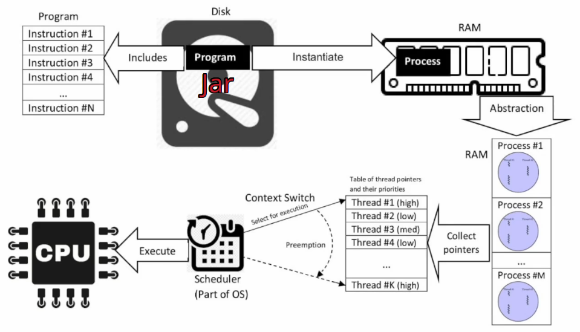
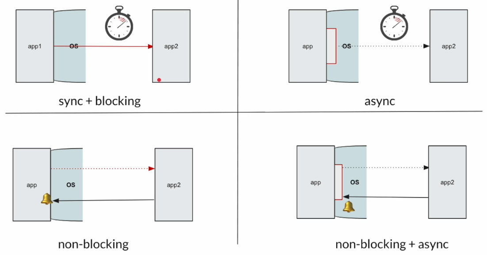
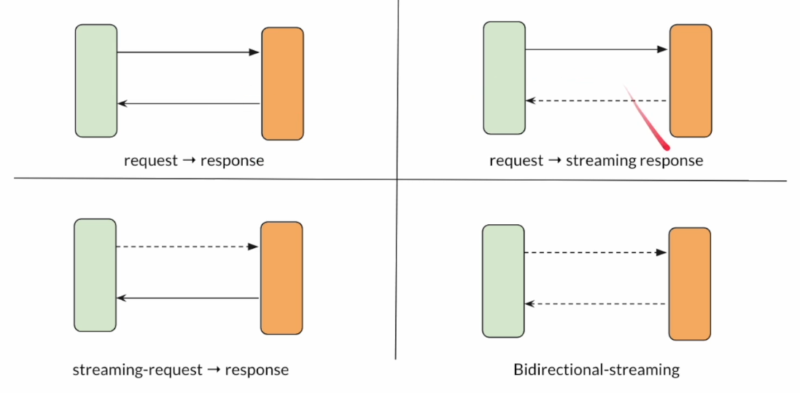
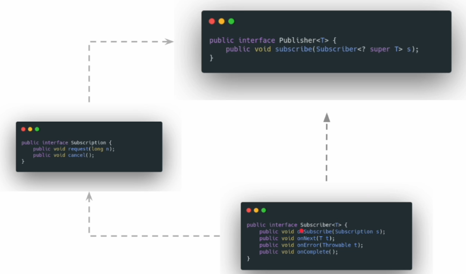
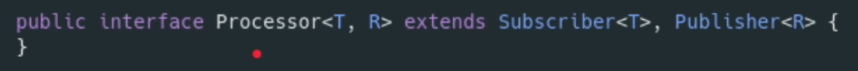
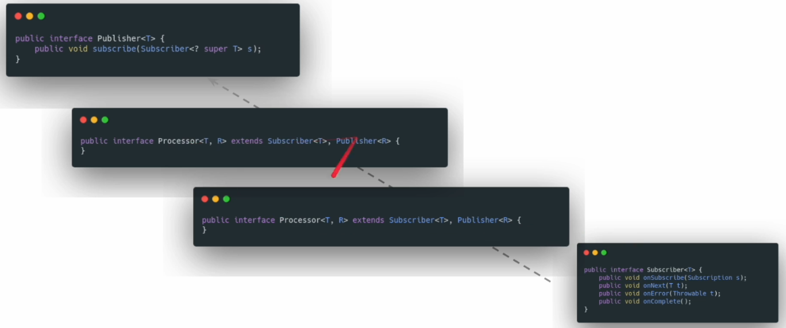
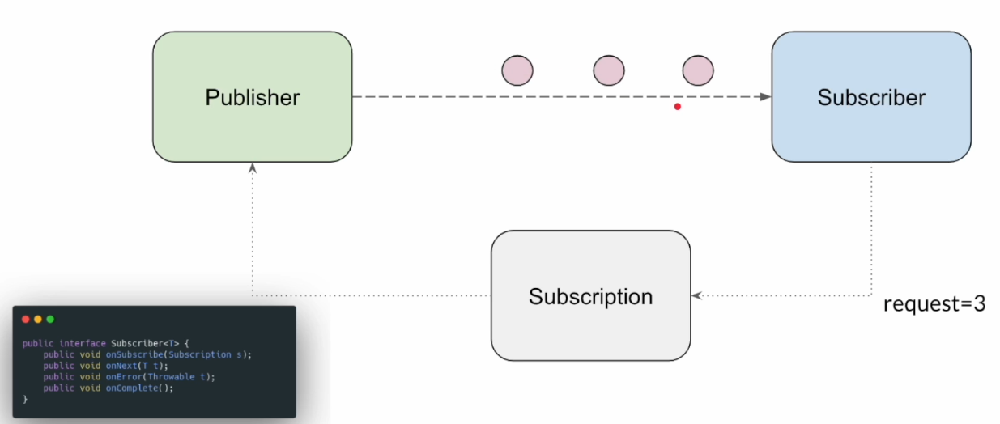
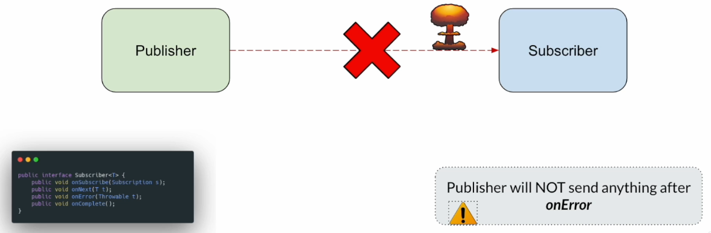

# MASTERING JAVA REACTIVE PROGRAMMING (FROM SCRATCH)

Del curso de UDEMY: https://www.udemy.com/course/complete-java-reactive-programming

## Introducción

Esta es la parte teórica del curso, y la idea es situarnos en un punto concreto de conocimiento antes de comenzar con la programación reactiva.

### Pilares de OOP vs pilares de la programación reactiva

Los pilares de la programación orientada a objetos son:

- Abstracción
- Encapsulación
- Herencia
- Polimorfismo

Los pilares de la programación reactiva son:

- No bloqueante
- Asíncrona
- Comunicación basada en flujos (stream based communication)
- Gestión de sobrecarga de datos (backpressure handling)

### Qué vamos a ver

- Process / Thread / RAM / CPU / Scheduler
- Sync / Async / Non-Blocking /  Non-Blocking + Async
- IO Communication Patterns
- Programación Reactiva
  - ¿Qué es?
  - ¿Por qué la necesitamos?
  - ¿Cómo funciona?
  - ¿Por qué no usar Virtual Threads?
  - Principios de la programación reactiva

### Process / Thread / RAM / CPU / Scheduler

Imagen tomada de Wikipedia.

- Un `proceso` es una instancia de un programa de ordenador que tiene su propio espacio de memoria aislado. Incluye el código, la data, otros recursos asignados por el Sistema Operativo como memory socket... Es costoso crear y destruir un proceso.
- La `CPU` (o `procesador`) es lo que ejecuta las intrucciones.
  - De forma simplificada, podemos decir que las CPUs modernas pueden tener varios `cores`. Cada core puede verse como un procesador.
- Un `Thread del Sistema Operativo` es una parte del proceso, y un proceso puede contener uno o más threads. Los threads dentro de un proceso pueden compartir el espacio de memoria.
  - Podemos ver un proceso como una unidad de recursos y un thread como una unidad de ejecución.
- El Sistema Operativo tiene un `Scheduler`, cuya misión es asignar el thread a la CPU para su ejecución y determinar cuanto tiempo puede ejecutarse ese thread. Si hay más de un core intentará asignar un thread a cada core.
  - El cambio que hace un Scheduler de un thread a otro se llama `context switch`. Cuando ocurre hay que almacenar el estado del thread saliente para poder recuperarlo luego en ese punto. Esta información se guarda en el `stack memory` cuyo tamaño, 1Mb o 2Mb generalmente, es determinado cuando comienza el proceso o se crea el thread, y no puede modificarse una vez el tread se ha creado.
  - También existe `heap memory` que es donde se almacenan objetos creados dinámicamente, como ArrayList, HashMap...
  - En la `stack memory` se almacenan las variables locales, referencias a objetos y la información de funciones llamadas.

#### Java Thread

- Un `Java Thread` es sencillamente una envoltura alrededor de un OS Thread.
  - 1 Java Thread = 1 OS Thread

#### Problema

- La CPU es muy costosa (en dinero, por ejemplo, el uso de la nube es muy costoso).
  - Hay que intentar usar la CPU todo lo posible.
- Normalmente, en una arquitectura de microservicios, hay muchas llamadas de red, pero son lentas y los threads quedan ociosos. Por eso los desarrolladores crean muchos threads para usar la CPU.
- Un thread es un recurso muy costoso.
  - Coste aquí significa pesado, que consume mucha memoria.
- Necesitamos un mecanismo para hacer más eficientes estas llamadas de red, sin desperdiciar recursos del sistema.

### IO Models

IO significa `Inbound / Outbound`, es decir, Entrante / Saliente.

Los modelos son los siguientes:

- Sync
  - Nuestra app hace una petición a otra app, y el thread espera ociosamente hasta obtener la respuesta.
- Async
  - Nuestra app puede usar un thread pool. Un thread 1 puede crear otro thread 2 y delegar la tarea, quedando libre el thread 1, pero el thread 2 tendrá que esperar ociosamente hasta obtener la respuesta.
- Non-Blocking
  - Nuestra app hace una petición a otra app, y el thread no queda bloqueado, puede seguir con otra tarea. El Sistema Operativo notificará al thread con la respuesta.
- Non-Blocking + Async
  - Si tenemos varias CPUs también podemos tener más threads.
  - Nuestra app hace una petición a otra app, y el thread no queda bloqueado, puede seguir con otra tarea. Cuando el Sistema Operativo notifique que ya tiene la respuesta, lo hará a otro thread distinto al que hizo la petición, haciendo uso de varias CPUs.

La programación reactiva es un modelo de programación que intenta simplificar la comunicación Non-Blocking + Async.

### ¿Por qué no usar Virtual Threads?

¿Necesitamos realmente la programación reactiva? ¿No podría conseguir lo mismo usando Virtual Threads?

Bueno, los Virtual Threads son geniales, pero podrían no ser suficiente, porque estamos intentando resolver un problema diferente al que resuelven los Virtual Threads.

Si nuestros requerimientos solo incluyen hacer peticiones y esperar respuestas (request -> response, basado en Pull), entonces si, los Virtual Threads serían suficiente y no haría falta complicarnos la vida con la programación reactiva.

La programación reactiva abre la puerta a tres patrones de comunicación adicionales más el típico request -> response:

- request -> response
  - El de toda la vida, se hace una petición y se obtiene una respueta.
  - Modelo híbrido Push/Pull.
- request -> streaming response
  - Se hace una petición y podemos obtener varias respuestas periódicas.
  - Modelo híbrido Push/Pull.
  - Por ejemplo, pedimos una pizza online y vamos obteniendo las distintas anotaciones: Pizza preparándose, pizza preparada, pizza en entrega...
- streaming request -> response
  - Se hacen peticiones periódicas a un servidor remoto.
  - Es muy importante indicar que streaming request no significa hacer muchas peticiones HTTP, sino que se refiere a que se abre una conexión por la que se mandan varios flujos de mensajes al servidor remoto.
  - Modelo híbrido Push/Pull.
  - Por ejemplo, desde un Apple Watch se envían periódicamente las pulsaciones al servidor remoto.
- Bidirectional streaming
  - Las dos aplicaciones se comunican como lo haría un ser humano, intercambiando mensajes.
  - Modelo híbrido Push/Pull.

Con la programación reactiva podemos conseguir fácilmente estos cuatro patrones de comunicación.

Sin embargo, los Virtual Threads, la concurrencia estructurada no puede resolver todos estos problemas.

Pero, si se quiere usar Virtual Threads para programación reactiva, entonces eso si es posible.

### ¿Qué es la programación reactiva?

- Es un paradigma de programación diseñada para procesar flujos (streams) de mensajes de manera no bloqueante (non-blocking) y asíncrona, mientras se maneja backpressure.
- Está basada en el patrón de diseño Observer.

Veamos distintos lenguajes de programación y sus paradigmas de programación:

- C: Lenguaje de programación procedural.
  - La unidad de reutilización es la función.
- Java: Lenguaje de programación orientado a objetos.
  - La unidad de reutilización es la clase.
  - La data y los métodos están juntos.
  - Estructuras de datos como List / Set / Map ...
  - Pero no tenemos herramientas para simplificar llamadas IO asíncronas no bloqueantes.

- La programación reactiva se creó para llamadas IO (Inbound/Outbound)
- La programación reactiva complementa la programación orientada a objetos proveyendo herramientas y abstracciones poderosas para manejar llamadas IO asíncronas y gestionar flujos de datos complejos en aplicaciones modernas.

### Patrón Observer

Vamos a hablar de como funciona la programación reactiva.

Esta basada en el patrón Observer, que consiste en observar y reaccionar al stream (flujo) de mensajes, en caso de cambios.

Como parte de la especificación de flujos reactivos, definieron un conjunto de interfaces para modelar como funcionará la comunicación.

El `Subscriber` sigue al `Publisher` y su relación se muestra vía un objeto `Subscription`.

Si el Subscriber quiere obtener más actualizaciones del Publisher, puede hacer peticiones a Subscription usando el método `request(long n)` al Publisher.

Igualmente, si el Subscriber ya no quiere obtener más actualizaciones del Publisher, o si quiere dejar de seguirlo, entonces puede usar el método `cancel()` de Subscription y cancelar la relación.

Un Subscriber puede a su vez ser un Publisher de otros Subscribers. Para representar esto en la `Reactive Stream Specification` se usa la interface `Processor`, que puede actuar tanto como un Publisher como un Subscriber. Aquí su firma:

En la parte de arriba habrá un Publisher "puro" y en la parte de abajo habrá un Subscriber "puro", y entre medias varios Processors que actuarán como Subscriber de la parte de arriba y Publishers para la parte de abajo.

Al igual que tenemos una especificación JPA (Java Persistence API) que, por ejemplo implementa Hibernate, igualmente Reactive Streams es solo una especificación y hay varias librerías que la implementan:

- Akka streams.
- rxJava2.
- Reactor, que es el que vamos a usar en este curso.
  - Spring WebFlux
  - R2DBC (Postgres, MySQL, H2...)
  - Redis
  - Elasticsearch
  - Mongo
  - Kafka
  - RabbitMQ
  - RSocket
  - ...

### Comunicación Publisher / Subscriber

Vamos a ver algunas de las reglas básicas definidas en la especificación paso a paso.

**Paso 1: El Subscriber quiere conectar**

Hay dos instancias, una es el Publisher y la otra el Subscriber, y este último quiere obtener actualizaciones desde el Publisher.

La interface Publisher contiene el método `subscribe(Subscriber<? super T> s)`, que acepta la instancia Subscriber. De esta forma, el Subscriber obtendrá las actualizaciones del Publisher.

**Paso 2: Publisher llama onSubscribe**

Cuando el Publisher acepta la petición del Subscriber, entrega el objeto Subscription al Subscriber.

En la interface Subscriber existe el método `onSubscribe(Subscription s)`, que acepta la subscripción.

**Paso 3: Subscription**

La relación entre el Publisher y el Subscriber es establecida en este punto a través del objeto Subscription.

El Subscriber, usando el objeto Subscription puede ya hablar al Publisher. El Subscriber puede hacer peticiones de elementos que el Publisher dará al Subscriber usando el método `request(long n)` del objeto Subscription, o, si el Subscriber no quiere obtener ninguna actualización del Publisher, puede cancelar la relación usando el método `cancel()` del objeto Subscription.

**Paso 4: Publisher envía datos via onNext**

Cuando el Subscriber solicita elementos del Publisher usando el objeto Subscription, el Publisher llamará al método `onNext(T t)` del Subscriber para pasar los elementos al Subscriber de uno en uno.

Es muy importante entender que el Publisher dará solo el número de elementos pedidos o menos. Nunca dará más.

**Paso 5: onComplete**

Cuando el Publisher no tiene elementos que emitir, o si ya ha emitido todos los elementos al Subscriber, el Publisher puede llamar el método `onComplete()` del Subscriber para notificárle que su trabajo ya está hecho.

Una vez invocado el método `onComplete()` el Publisher no enviará nada más al Subscriber, por eso vemos en la imagen que su relación ha terminado. En este punto, el objeto Subscription ya no existe.

**Paso 6: onError**

El Subscriber pedirá elementos al Publisher vía el objeto Subscription.

Mientras se procesa la petición, el Publisher puede sufrir algún problema. En ese caso, el Publisher pasará los detalles de la excepción al Subscriber vía el método `onError(Throwable t)` del Subscriber.

Una vez se invoca este método, el Publisher no volverá a enviar nada más al Subscriber, y el objeto Subscription dejará de existir.

**Terminología**

Los desarrolladores usan esta terminología un poco indistintamente, es decir, al Publisher también lo pueden llamar Source o Upstream...

- Publisher
  - Source
  - Observable
  - Upstream
  - Producer
- Subscriber
  - Sink
  - Observer
  - Downstream
  - Consumer
- Processor
  - Operator

En la programación orientada a objetos, modelamos todo como una clase o un objeto. En ese caso, customer es un objeto, credit card es un objeto, car es un objeto.

Similarmente, con la programación reactiva, modelaremos la comunicación entre los dos componentes, Publisher y Subscriber. Por ejemplo, si tenemos una app front hecha en React y un backend, el backend sería el Publisher y la frontend app será el Subscriber, ya que espera la data del backend.

En una arquitectura de microservicios, un servicio depende de otro. El dependiente es el Subscriber y el otro sería el Publisher.

Una clase puede tener dos métodos, y uno de ellos puede depender del otro. En este caso, de nuevo el método dependiente sería el Subscriber y el que emite la data el Publisher.

Es decir, el que da la data será el Publisher y el que pregunta por dicha data, para obtenerla, será el Subscriber.

### Resumen

- Process / Thread / CPU / RAM / Scheduler
  - Más threads no significa mejor rendimiento.
  - 1 CPU puede ejecutar 1 thread a la vez. Solo necesitamos 1 thread por CPU.
- Las llamadas IO son llamadas que consumen tiempo y son bloqueantes. Para evitar crear demasiados threads, podemos usar comunicación no bloqueante.
- La comunicación IO no bloqueante + asíncrona es complicada. Necesitamos un modelo de programación diferente. La programación reactiva es un paradigma de programación que lo simplifica.
- La programación tradicional se basa en Pull.
  - Request -> Response
- La programación reactiva es un modelo híbrido Push/Pull.
  - Request -> Response
  - Request -> Streaming Response (Stock price updates)
  - Streaming Request -> Response (Video streaming...)
  - Bidirectional Streaming (Online Game)
- Pilares de la programación reactiva.
  - streams of messages
  - non-blocking
  - asynchronous
  - backpressure
- Igual que visualizamos todo en OOP como un objecto, debemos visualizar las dependencias externas como Publisher / Subscriber en la programación reactiva.
  - Publisher producirá la data.
  - Subscriber consumirá la data.
- Reglas de la programación reactiva
  - El Subscriber tiene que subscribirse y hacer peticiones al Producer para que produzca elementos. Mientras tanto el Producer no produce nada. Hay que ser lo más perezoso posible.
  - El Subscriber puede cancelar cuando quiera (El Producer no debe producir data después de la cancelación)
  - El Producer producirá elementos vía onNext
  - El Producer llamará a onComplete tras emitir data 0...N
  - El Producer llamará a onError en caso de problemas.
  - El Producer no producirá nada tras onComplete/onError. Un Subscription request o Subscription cancel no tendrá ningún tipo de efecto tras el onComplete/onError.

## Mono

[README.md](./01-reactive-programming-playground/README.md)

Para una implementación manual de un flujo reactivo, ver proyecto `01-reactive-programming-playground`, paquete `sec01`.

Para ver ejemplos de Project Reactor con Mono, ver proyecto `01-reactive-programming-playground`, paquete `sec02` donde están las siguientes clases:

- `Lec01LazyStream`
  - El objetivo de esta clase es entender que un flujo (stream) por defecto es lazy.
  - Hasta que el flujo no se conecta a una salida no se ejecuta ni se obtiene el resultado.
  - La programación reactiva es igual.
  - Hasta que no nos conectemos a un subscriber no se ejecuta nada ni obtendremos ningún resultado.
- `Lec02MonoJust`
  - Nuestra primera clase 100% reactiva.
  - Just es un Factory Method, ideal cuando tenemos data en memoria.
- `Lec03MonoSubscribe`
  - Vemos las sobrecargas sobre el método `subscribe()`.
- `Lec04MonoEmptyError`
  - Vemos como crear un publisher que no va a dar data y que pasa un mensaje de error.
- `Lec05MonoFromSupplier`
  - Vemos lo importante que es ser lo más perezoso (lazy) posible.
- `Lec06MonoFromCallable`
  - Vemos la diferencia entre Supplier y Callable.
- `Lec07MonoFromRunnable`
  - Devuelve empty, pero antes hace algo.
- `Lec08MonoFromFuture`
  - Usado para convertir un CompletableFuture en un publisher Mono.
- `Lec09PublisherCreateVsExecution`
  - Clase para clarificar que no es lo mismo crear un publisher que ejecutarlo.
- `Lec10MonoDefer`
  - Vemos como retrasar la creación de un publisher.
- En el package `common` creamos la clase abstracta `AbstractHttpClient`.
  - Clase abstracta usando Netty para enviar peticiones HTTP.
  - Con esto facilitamos el curso, ya que va a haber muchas demos y podemos extender esa clase abstracta rápidamente para enviar una petición o recibir una respuesta.
- En el package `sec02.client` creamos la clase `ExternalServiceClient` que extiende `AbstractHttpClient`.
  - Es nuestro cliente HTTP.
- `Lec11NonBlockingIO`
  - Usando el cliente ya construido, vamos a enviar una petición HTTP, en concreto, pasaremos un productId y obtendremos el nombre del producto.
- `FileService` y `FileServiceImpl` y la clase de prueba `Assignment`.
  - Es un ejercicio.

Creamos una implementación genérica de un Subscriber que vamos a reutilizar en los ejemplos. Ver proyecto `01-reactive-programming-playground`, paquete `common`.

## Flux

- Flux puede emitir 0, 1 ... N items.
- Seguido de onComplete / onError.

Puede ser un flujo de mensajes interminable, y, en este caso, nunca obtendremos un onComplete/onError.

Flux, al igual que Mono, provee factory methods para poder crearlo rápidamente a partir de data existente, como, por ejemplo:

- just
  - Muy útil cuando tenemos data en memoria.
- fromIterable
  - Si tenemos una lista o array, o un Java stream.
- fromArray
- fromStream

[README.md](./01-reactive-programming-playground/README.md)

Para ver ejemplos de Project Reactor con Flux, ver proyecto `01-reactive-programming-playground`, paquete `sec03` donde están las siguientes clases:

- `Lec01FluxJust`
  - Just es un Factory Method, ideal cuando tenemos data en memoria.
- `Lec02MultipleSubscribers`
  - Vemos que un publisher puede tener varios subscribers y aplicamos filtros y map.
- `Lec03FluxFromIterableOrArray`
  - Vamos a ver como crear un publisher Flux a partir de un array o un iterable.
- `Lec04FluxFromStream`
  - Vamos a ver como crear un publisher Flux a partir de un Java Stream.
- `Lec05FluxRange`
  - Vamos a crear un publisher Flux a partir de un rango de números.
  - Podemos usarlo como un bucle for en programación reactiva.
- `Lec06Log`
  - El operador log nos permite ver lo que está pasando en el publisher, es decir, ver los items que se están emitiendo.
  - Es muy útil para debugging.
- `Lec07FluxVsList`
  - Creamos una funcionalidad con un publisher Flux y una lista, y vemos las diferencias.
  - Y en `src/java/com/jmunoz/sec03/helper` creamos la clase:
    - `NameGenerator` que nos permite generar nombres aleatorios.
- `Lec08NonBlockingIOStreamingMessages`
  - En `src/java/com/jmunoz/sec03/client` creamos la clase:
    - `ExternalServiceClient` donde enviamos una petición HTTP.
- `Lec09FluxInterval`
  - Vamos a ver como crear un publisher Flux que emite items periódicamente.
- `Lec10FluxEmptyError`
  - Vamos a ver como crear un publisher que no va a dar data y que pasa un mensaje de error.
- `Lec11FluxMono`
  - Vamos a ver como convertir un Mono en un Flux y viceversa.
- `Assignment`
  - Es un ejercicio.

## Flux - Emitir items programáticamente

Vamos a ver como emitir items programáticamente, por ejemplo emitir data hasta que se cumpla una condición.

[README.md](./01-reactive-programming-playground/README.md)

Para ver ejemplos ver proyecto `01-reactive-programming-playground`, paquete `sec04` donde están las siguientes clases:

- `Lec01FluxCreate`
  - Vemos el método `Fkux.create()`
- En `src/java/com/jmunoz/sec04/helper` creamos la clase:   
  - `NameGenerator`
    - Implementamos un consumer.
  - `Lec02FluxCreateRefactor`
    - Vemos como refactorizar `Lec01FluxCreate` para que sea más limpio.
- `Lec03FluxSinkThreadSafety`
  - Vemos como usar Flux Sink para emitir items desde diferentes threads.
- `Lec04FluxCreateDownstreamDemand`
  - Vemos un comportamiento por defecto de Flux Create, que es que el producer produce los items por adelantado, sin esperar a que el subscriber haga un request.
- `Lec04bFluxCreateDownstreamDemand`
  - Cambiamos el comportamiento de `Lec04FluxSinkThreadSafety` para que el producer produzca los items solo cuando el subscriber hace un request.
- `Lec05TakeOperator`
  - Vemos como usar el operador `take()` para limitar el número de items que se emiten.
  - Vemos como usar el operador `takeWhile()` para emitir items mientras se cumpla una condición. Para cuando la condición ya no se cumple.
  - Vemos como usar el operador `takeUntil()` para emitir items hasta que se cumpla una condición. Para cuando la condición se cumple.
- `Lec06FluxGenerate`
  - Vemos en este ejemplo que `Flux.generate()` solo permite emitir un item, pero las veces que queramos, bajo demanda.
- `Lec07FluxGenerateUntil`
  - Vemos como usar `Flux.generate()` para emitir items hasta que se cumpla una condición.
- `Lec08GenerateWithState`
  - Vemos los problemas que pueden surgir al usar `Flux.generate()` con un estado mutable.
- `Lec08bGenerateWithState`
  - Vemos la solución al problema del estado mutable usando un estado inicial.
- `FileReaderService` y `FileReaderServiceImpl` y la clase de prueba `Assignment`.
  - Es un ejercicio.

## Operators

[README.md](./01-reactive-programming-playground/README.md)

Para ver ejemplos ver proyecto `01-reactive-programming-playground`, paquete `sec05` donde están las siguientes clases:

- `Lec01Handle`
  - Handle se comporta como un filter + map.
- `Lec02HandleUntil`
  - Ejemplo de uso de handle para filtrar hasta que se encuentre un elemento específico.
- `Lec03DoCallbacks`
  - Vemos ejemplos de como usar los callbacks doOnNext, doOnSubscribe, doOnComplete, doOnError, doOnCancel, doFinally, doOnRequest...
- `Lec04Delay`
  - Vemos como retrasar la emisión de items usando el operador `delayElements()`.
- `Lec05Subscribe`
  - Vemos los operadores doOnNext(), doOnComplete() y doOnError(), que se pueden usar en vez de indicar el subscriber en .subscribe().
- `Lec06ErrorHandling`
  - Vemos las formas de manejar errores en un flujo reactivo, valiendo igual para Mono que para Flux.
- `Lec07DefaultIfEmpty`
  - Vemos como usar el operador `defaultIfEmpty()` para devolver un valor por defecto si el publisher no emite ningún item.
- `Lec08SwitchIfEmpty`
  - Vemos como usar el operador `switchIfEmpty()` para cambiar a otro publisher si el publisher original no emite ningún item.
- `Lec09Timeout`
  - Vemos como usar el operador `timeout()` para manejar el timeout en un flujo reactivo.
- `Lec10Transform`
  - Vemos como usar el operador `transform()` para construir pasos reutilizables en un pipeline reactivo.
- En `src/java/com/jmunoz/sec05/assignment` creamos la clase `Assignment`.
  - Es un ejercicio.
- En `src/java/com/jmunoz/sec05/client` creamos un método en la clase `ExternalServiceClient` para usar en el ejercicio.